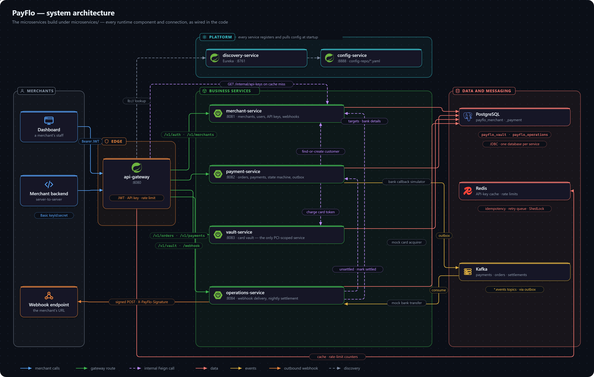
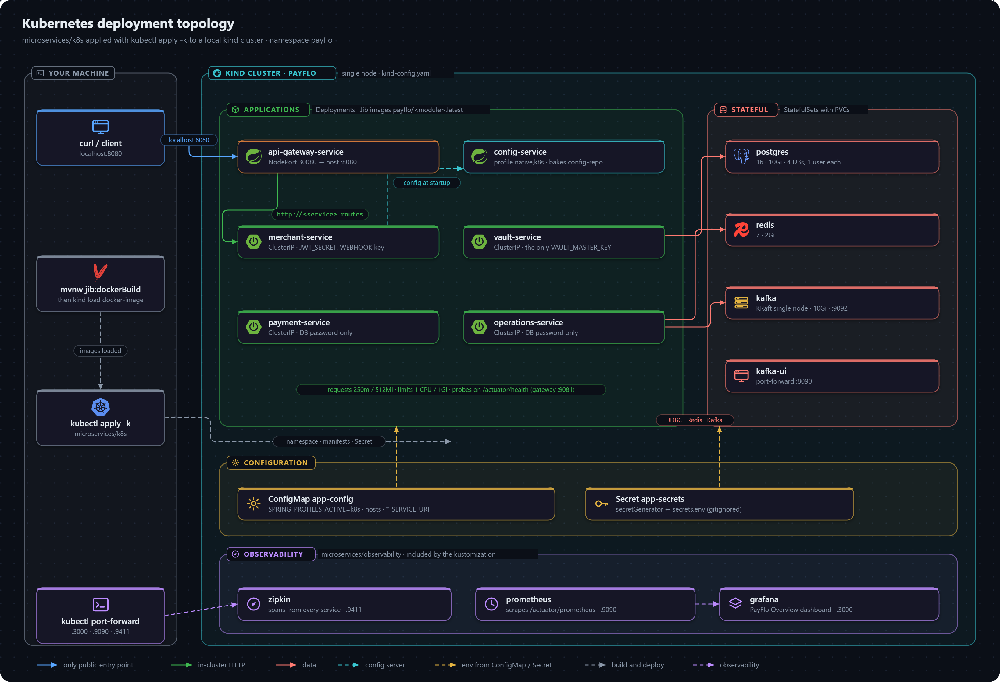

# PayFlo

[](https://github.com/Divyanshu2805/payflo/actions/workflows/ci.yml)


**A payment gateway backend: orders, payments, a card vault, signed webhooks and nightly payouts, built as Spring Boot microservices.**

PayFlo is the part behind a "Pay now" button. A business signs up, gets API keys, creates orders and takes payments by card, UPI, net banking or wallet. Card numbers go into an isolated vault and come back as tokens. Every change is announced to the business's own systems as a signed webhook, and each night the business is paid out, minus the platform fee and GST.

The bank side (acquirer, authorization callback, payouts) is simulated, so every flow runs on one machine with no external accounts.

## See it running

With Docker running, a JDK 25 and Python 3.10+:

```bash
git clone https://github.com/Divyanshu2805/payflo.git
cd payflo/microservices
python demo/demo.py
```

That one command starts PostgreSQL, Redis and Kafka, builds the services, starts all seven, and seeds a demo merchant through the public API: KYC, an API key, webhooks, payments by every method, the failure cases, a refund, and a settlement. The first run takes a few minutes for the build; after that about one.

Then open what it prints:

| | |
|---|---|
| **Dashboard** | <http://localhost:5173>: orders, a checkout with the test values one click away, payments, refunds, settlements, webhooks and their deliveries, API keys, the audit log, and the platform operator's console. A bar along the bottom lists every API request the page makes |
| **API reference** | <http://localhost:5173/docs.html>: Swagger UI over [`docs/api/openapi.yaml`](docs/api/openapi.yaml), with "Try it out" calling the real API |
| **Postman** | Import [`docs/api/payflo.postman_collection.json`](docs/api/payflo.postman_collection.json): the same API as a walkthrough |

If ports 8080 to 8084 are taken, `python demo/demo.py --port-offset 100` moves everything. `python demo/demo.py stop` stops the services. Details: [the demo and the dashboard](docs/local-development/demo-and-dashboard.md). To start each service by hand instead, see [first-time setup](docs/local-development/setup.md).

## What it does

- **Two ways in.** A JWT for a merchant's staff, API keys (HTTP Basic) for a merchant's backend, both verified once at the gateway, with per-key rate limiting. Three roles; a `TEAM` login is read-only.
- **Orders and payments.** Card, UPI, net banking and wallet through a strategy layer of adapters and processors, driven by a validated, logged payment state machine.
- **A saga, not a long transaction.** Payment initiation never holds a database transaction across a network call, and compensates when the acquirer is unreachable.
- **A card vault.** Card data lives in its own service and database, with per-card envelope encryption. Every other service only ever sees a token, and a log filter masks any card number that slips into a log line.
- **Events through an outbox.** Every change is published to Kafka from a transactional outbox, so a crash can't lose an event.
- **Webhooks.** HMAC-signed and timestamped per attempt (a replayed request fails verification), retried on a fixed schedule for 24 hours, then dead-lettered and replayable.
- **Nightly settlement.** Per-merchant payouts with a fee and GST breakdown, net of refunds, as a recoverable saga, linked back to every payment they cover.
- **Idempotent writes.** Any write can be retried safely with `X-Idempotency-Key`; the same key with a different request is refused.
- **Abuse and accountability.** Card-testing limits on tokenizing and card payments, signup that doesn't reveal which emails exist, an append-only audit log written in the same transaction as each sensitive change, and an operator API behind its own key.
- **Analytics.** A live dashboard and date-range reports per merchant.
- **Observable.** One trace per request across every service in Zipkin, Prometheus metrics with latency histograms, and a Grafana dashboard that tracks the throughput, p99, availability and webhook-SLA targets.

## How a payment flows

1. **Sign up and get credentials.** merchant-service creates the merchant and issues a JWT and API keys.
2. **Create an order.** payment-service records what is being paid for, resolving the customer from merchant-service first.
3. **Pay.** The payment moves to `AUTHORIZING`; a card is charged by vault-service using only its token.
4. **The bank answers.** A simulated bank authorizes and captures the payment within seconds; the order becomes `PAID`.
5. **The merchant is told.** The outbox publishes the change to Kafka, and operations-service delivers a signed webhook.
6. **The merchant is paid.** At 23:00 operations-service settles each merchant's captured payments to their bank account.

## Architecture



A Spring Cloud Gateway authenticates every request and routes it to one of four business services (**merchant**, **payment**, **vault** and **operations**), each with its own PostgreSQL database. Services find each other through Eureka, pull their configuration from a config server, call each other over a private `/internal` API with circuit breakers and retries, and exchange events through Kafka. **Card numbers never leave vault-service**, and authentication happens in exactly one place.

The design decisions, each with the alternatives it was chosen over:

| Decision | Why |
|---|---|
| [Monolith first, then split](docs/architecture/decisions/0001-monolith-first-then-split.md) | Find the service boundaries while moving them is cheap |
| [Card data isolated in vault-service](docs/architecture/decisions/0004-isolate-card-data-in-vault-service.md) | One small service in PCI scope instead of all of them |
| [Transactional outbox for events](docs/architecture/decisions/0005-transactional-outbox-for-events.md) | A change and its event commit together or not at all |
| [Payment initiation as a saga](docs/architecture/decisions/0006-payment-initiation-as-a-saga.md) | No database connection held across a remote call |
| [A validated payment state machine](docs/architecture/decisions/0007-validated-payment-state-machine.md) | An illegal status change is impossible, and every change is logged |

More: [architecture overview](docs/architecture/README.md) · [security model](docs/architecture/security-model.md) · [all decisions](docs/architecture/decisions/README.md)

## Measured

Everything below was measured on one laptop, with the load generator, the databases and all seven services on the same machine. What each optimisation contributed is in [what was built and what it measured](docs/project-summary.md).

| What | Measured |
|---|---|
| Throughput | **~1,270 req/s**, with payments captured alongside (96% within the run); the first run managed 250 |
| p99 latency | **171 ms** for the slowest request type |
| Errors under load | **0 failed requests** in 227,613 |
| Webhook delivery | **99.85%** of 91,644 events within 30 s (it was 5.4% before the load test exposed why) |
| Horizontal scaling | **338 → 758 → 999 req/s** on 1, 2 and 3 Kubernetes replicas of the gateway and payment-service; a rolling restart under load lost 19 of 226,834 requests |
| Crashes and outages | **7 scenarios, all passing**: kill a service or stop PostgreSQL, Redis or Kafka under load; nothing lost, duplicated or stuck |

The 5× since the first run came from 19 fixes, every one of them invisible one request at a time: the gateway's 5-connection proxy pool, Open-Session-In-View holding connections across remote calls, an outbox row updated right after its insert, a webhook consumer committing once per event. The laptop was the limit in the final runs (processors at about 96%), and the request path scaled 3.0× on three replicas, so [more would come from capacity, not a redesign](docs/project-summary.md#where-more-would-come-from).

## Testing

`./mvnw verify` in `microservices/` runs every unit test and every integration test, and needs only Docker: the integration tests start each service as the real application on real PostgreSQL, Redis and Kafka in containers. CI runs the same command on every push, plus a check that the OpenAPI spec matches the controllers, a dependency vulnerability scan and a secret scan. See [testing](docs/practices/testing.md).

## Scope

PayFlo was built to show how a payment backend is designed, run and measured, against a simulated bank on one machine. It was never meant to carry real money, so it leaves out what only that requires: a real acquirer and reconciliation, a PCI DSS assessment, a secret store and encrypted traffic between services, multi-factor login, and highly available data stores. What the design accepts, and why, is in [design trade-offs and scope](docs/architecture/trade-offs.md).

## Tech stack

| Layer | Technologies |
|---|---|
| Backend | Java 25, Spring Boot 4.1, Spring Cloud 2025.1 (Gateway, Eureka, Config, OpenFeign), Resilience4j, Spring Data JPA, Flyway, Lombok, MapStruct |
| Data and messaging | PostgreSQL (one database per service), Redis, Apache Kafka, ShedLock |
| Security | jjwt, bcrypt and AES-256-GCM via Spring Security Crypto |
| Infrastructure | Docker Compose, Jib, Kubernetes (kind), Kustomize, GitHub Actions |
| Observability and testing | Micrometer Tracing, Zipkin, Prometheus, Grafana, JUnit, Testcontainers, Apache JMeter |
| Dashboard and tooling | Plain HTML, CSS and JavaScript modules (no build step); Python standard library for the demo, load-test and crash-test scripts |

Details and versions: [tech stack](docs/tech-stack.md).

## Project structure

```
microservices/
  common-lib/             shared entities, enums, errors, MerchantContext, rate limiters, idempotency, DTOs
  discovery-service/      Eureka (:8761)
  config-service/         Spring Cloud Config over config-repo/ (:8888)
  config-repo/            every service's configuration, including the k8s profile
  api-gateway-service/    authentication, rate limiting, routing (:8080)
  merchant-service/       merchants, users, API keys, customers, webhook configs, the audit log (:8081)
  payment-service/        orders, payments, state machine, saga, outbox, bank simulator (:8082)
  vault-service/          card tokenization and charging (:8083)
  operations-service/     webhook delivery and nightly settlement (:8084)
  demo/                   the one-command demo
  dashboard/              the web dashboard and its server (:5173)
  k8s/, k8s-scaled/       Kubernetes manifests (Kustomize), and an overlay with three replicas
  observability/          Zipkin, Prometheus, Grafana
  load-test/, chaos/      the JMeter plan and its scripts; the crash and outage tests
services.docker-compose.yaml   local PostgreSQL, Redis, Kafka, Control Center
docs/                     documentation
```

## Deployment

The whole system runs on a local kind cluster: one namespace, the six applications built as Jib images, PostgreSQL, Redis and Kafka as StatefulSets, and only the gateway exposed. Secrets come from a gitignored file through a Kustomize `secretGenerator`, and each pod gets only the secrets it needs.



See [deployment](docs/deployment/README.md).

## Documentation

| Section | Contents |
|---|---|
| [The demo and the dashboard](docs/local-development/demo-and-dashboard.md) | One command, and what to look at |
| [What was built and what it measured](docs/project-summary.md) | The idea, each decision and optimisation, and its effect |
| [Local development](docs/local-development/README.md) | Setup by hand, configuration, troubleshooting |
| [Architecture](docs/architecture/README.md) | Services, request flows, security model, decision records, trade-offs |
| [API reference](docs/api/README.md) | Every endpoint, the OpenAPI spec, the mock acquirer, idempotency, errors |
| [Data model](docs/schema/README.md) | Databases, entities, state machines, schema conventions |
| [Engineering practices](docs/practices/README.md) | Conventions, testing, guardrails, known pitfalls |
| [Deployment](docs/deployment/README.md) | Running and scaling on Kubernetes |
| [Observability](docs/observability/README.md) | Tracing, metrics and the Grafana dashboard |
| [Load testing](docs/load-testing/README.md) | Running the load test and the measured results |
| [Crash and outage tests](docs/reliability/crash-and-outage-tests.md) | What happens to a payment when something dies |

The full index is at [`docs/`](docs/README.md), and the design targets are in [requirements](docs/requirements.md).

## Contributing

[`CONTRIBUTING.md`](CONTRIBUTING.md) describes how to work on the codebase: the workflow, conventions and checks every change goes through. To report a security issue, follow [`SECURITY.md`](SECURITY.md) instead of opening a public issue.

## Project history

PayFlo was built as a single Spring Boot application first, so the boundaries between its domains could be found and moved cheaply, then split into the current services along those boundaries ([ADR 0001](docs/architecture/decisions/0001-monolith-first-then-split.md)). The single application was removed once everything had been carried over; it remains in the repository's history.
