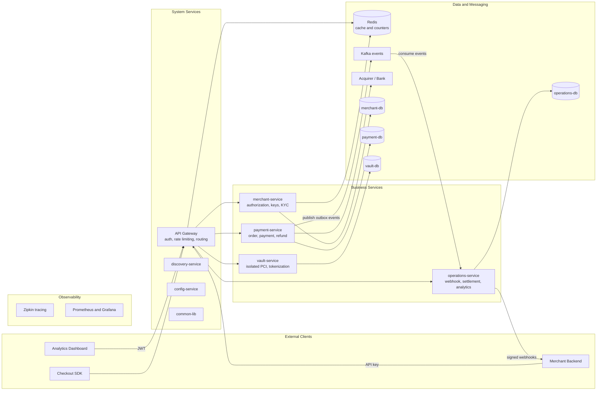

# Architecture

[← Back to docs index](README.md)

## Build strategy: monolith first

PayFlo is being built as a **single monolithic application first**, and will be split into microservices
only later, as a deliberate second phase. This is a decision, not an interim accident.

The reasoning: domain boundaries are cheap to move inside one codebase and expensive to move once
they're network calls between separately deployed services. Building the whole thing as a monolith lets
those boundaries be found and corrected while a mistake costs a refactor instead of a migration. The
distributed-systems machinery (service discovery, an API gateway, per-service databases, inter-service
messaging) also carries real operational cost, and it buys nothing until there's something worth scaling
independently.

So the split is being *prepared for* without being *paid for* yet — through three conventions held from
day one:

- **Domain-oriented packages** (`common`, `merchant`, `payment`, `vault`, `operations`) rather than
  layer-oriented ones (`controller`, `service`, `repository`), so each domain is a candidate service
  boundary already.
- **No cross-domain foreign keys** — `ORDER_RECORD`/`PAYMENT`/`REFUND` reference `merchant_id` as a plain
  UUID, because a real FK can't span two databases and would have to be torn out at split time anyway.
- **Shared types isolated in `common`**, so what would become a shared library is already identifiable.

**As of 2025-12-16, phase 1 is feature-frozen and the split into Target below begins.** "Today"
is now a snapshot of the final monolith state, not a moving description of current work.

## Today (final monolith state, frozen 2025-12-16)

- A **single Spring Boot application** — one deployable, one database, no inter-service network
  calls. Kafka is in use, but entirely in-process (a transactional outbox and its own consumer
  inside the same JVM) — see [Practices](practices.md) and the Kafka callout in
  [CLAUDE.md](CLAUDE.md).
- Base package `com.project.payflo`, organized by **domain**, not by technical layer — each domain
  owns its own `entity`/`repository`/`service`/`controller` subpackages (`operations` is the
  exception — Kafka-consumer classes instead of a classic service layer, see
  [Practices](practices.md)), anticipating the microservices split below:
  - `common` — shared value types, enums, exceptions, and config (`BaseEntity`, `Money`, AES
    encryption, Kafka/Redis config) used across domains.
  - `merchant` — merchant, API key, dashboard user, customer, and webhook-config entities, plus
    auth (JWT + API key), rate limiting, and webhook config CRUD.
  - `payment` — order, payment, refund, payment-transition-log, and outbox-event entities, plus the
    order/payment lifecycle, the payment gateway/processor adapter layers, and the transactional
    outbox.
  - `vault` — card tokenization/vaulting, isolated encryption config.
  - `operations` — webhook delivery pipeline (Kafka consumer → retry → DLQ); settlement and
    analytics not started.
- A full REST API exists — see [Project Status](status.md) for the count and
  [APIs](api.md) for every endpoint. Refunds, settlement, and analytics were never built; see
  [Phase 1 → Phase 2 handoff](status.md#phase-1--phase-2-handoff) for the complete carried-forward list.
- Standard Spring Boot layout otherwise (`src/main/java`, `src/main/resources`, `src/test/java`).

## Target

The **phase-two** architecture, now being built. The `common`/`merchant`/`payment`/`vault`/
`operations` package boundaries above and the no-cross-domain-FK convention exist specifically to
make this split cheap. None of the system/business-service split below exists yet — no gateway, no
service discovery, no config server, no per-service databases — but the message broker in the
diagram's **Data and Messaging** layer is a head start: Kafka is already running (locally, via
`services.docker-compose.yaml`) and already carries the domain events (`payments.events`/
`orders.events`/etc.) that a split `payment-service`/`operations-service` would need to exchange —
today's producer (`OutboxPoller`) and consumer (`WebhookKafkaConsumer`) just happen to run in the
same JVM. It's recorded here as the destination the conventions above were protecting the option to
reach.

Key points the diagram encodes:

- **`vault-service` is deliberately isolated** so PCI-regulated card data lives behind its own service
  and its own database, keeping the compliance scope as small as possible.
- **Database per service** — no shared database, which is why `ORDER_RECORD`/`PAYMENT`/`REFUND` reference
  `merchant_id` as a plain UUID instead of a foreign key.
- **Kafka decouples payment from operations** via the transactional outbox pattern: `payment-service`
  writes events to an outbox table in the same transaction as the payment, and `operations-service`
  consumes them to drive webhooks, settlement, and analytics.
- **Redis** backs both caching and the per-merchant rate-limit counters at the gateway.
