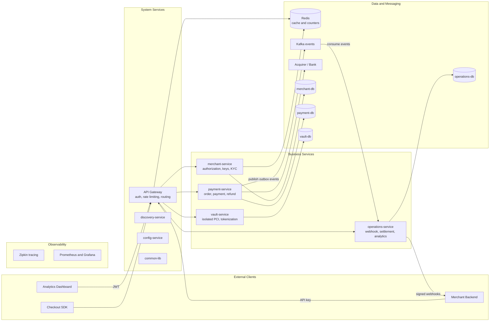

# Architecture

[← Back to docs index](README.md)

## Today

- Base package `com.project.payflo`, organized by **domain**, not by technical layer — each domain owns
  its own `entity` (and eventually `service`/`repository`/`controller`) subpackages, anticipating the
  microservices split below:
  - `common` — shared value types and enums used across domains (`BaseEntity`, `Money`, status/type enums).
  - `merchant` — merchant, API key, dashboard user, and customer entities.
  - `payment` — order, payment, refund, and payment-transition-log entities.
- Only the JPA entity layer exists so far — no `repository`, `service`, or `controller` layers, no APIs.
  The app compiles and can create its schema, but there's nothing to call yet.
- Standard Spring Boot layout otherwise (`src/main/java`, `src/main/resources`, `src/test/java`).
- It is a **single Spring Boot application**, not yet multiple services.

## Target

The intended end-state architecture. None of this is built yet — it's the shape the current package
layout and no-cross-domain-FK convention are designed to make possible later.

Key points the diagram encodes:

- **`vault-service` is deliberately isolated** so PCI-regulated card data lives behind its own service
  and its own database, keeping the compliance scope as small as possible.
- **Database per service** — no shared database, which is why `ORDER_RECORD`/`PAYMENT`/`REFUND` reference
  `merchant_id` as a plain UUID instead of a foreign key.
- **Kafka decouples payment from operations** via the transactional outbox pattern: `payment-service`
  writes events to an outbox table in the same transaction as the payment, and `operations-service`
  consumes them to drive webhooks, settlement, and analytics.
- **Redis** backs both caching and the per-merchant rate-limit counters at the gateway.
