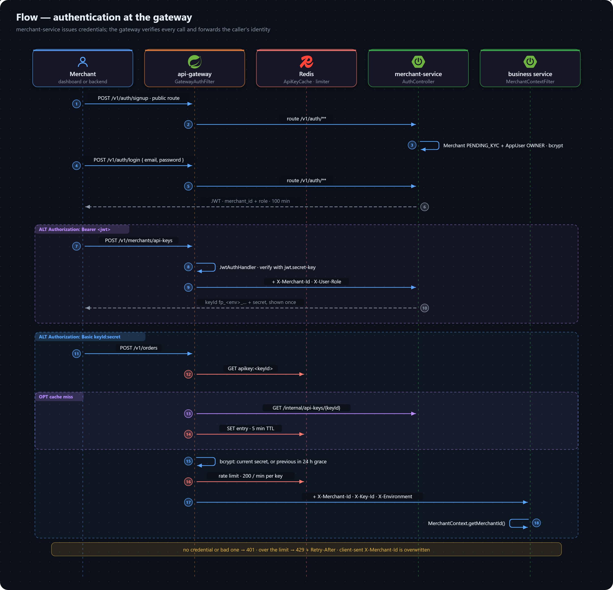

# Flow: Authentication

How a merchant gets credentials, and how every other service trusts a request without checking a credential itself. merchant-service issues credentials; the gateway verifies them.

## Getting credentials

1. **Sign up.** `POST /v1/auth/signup` is a public route. `AuthController` → `AuthServiceImpl.signup` rejects a duplicate email (`409 DUPLICATE_MERCHANT_EMAIL`), then creates the `Merchant` (status forced to `PENDING_KYC`) and its first `AppUser` (role `OWNER`, password bcrypt-hashed) in one transaction.
2. **Log in.** `POST /v1/auth/login` is public too. The password is checked with bcrypt. A wrong password is `400 INVALID_CREDENTIALS`, but an unknown email is `404 USER_NOT_FOUND` — so the response reveals whether an email is registered ([known gaps](../../known-gaps/not-yet-built.md#security)). On success `JwtUtil.generateAccessToken` returns an HMAC-signed JWT carrying `merchant_id` and `role`, valid for 100 minutes. There is no refresh token in the microservices — log in again.
3. **Create an API key.** With the JWT, `POST /v1/merchants/api-keys { environment }` returns a `keyId` (`fp_test_…` or `fp_live_…`) and a secret. The secret is generated with `SecureRandom`, returned **once**, and stored only as a bcrypt hash.

## Every later request

`api-gateway-service/security/GatewayAuthFilter` runs before routing. It skips `app.security.public-routes`, and otherwise branches on the `Authorization` header:

- **`Bearer <jwt>`** → `JwtAuthHandler` verifies the signature and expiry with `jwt.secret-key` — the same key merchant-service signs with, shared through config-service — and yields `X-Merchant-Id` and `X-User-Role`.
- **`Basic base64(keyId:secret)`** → `ApiKeyAuthHandler`:
  1. reads `apikey:<keyId>` from the Redis `ApiKeyCache`; on a miss, loads it with `GET /internal/api-keys/{keyId}` from merchant-service and caches it for 5 minutes;
  2. rejects a disabled key, then bcrypt-compares the secret against the current hash — or, during the 24-hour grace period after a rotation, the previous hash too;
  3. applies the per-key rate limit (200 per minute), setting `X-RateLimit-Limit` / `X-RateLimit-Remaining`;
  4. yields `X-Merchant-Id`, `X-Key-Id` and `X-Environment`.
- **Anything else** → `401 UNAUTHORIZED`.

The yielded headers are applied with `HeaderAugmentingRequestWrapper`, so a client can't override the values the gateway sets. The request is then routed.

## In the business service

`common-lib/web/MerchantContextFilter` reads `X-Merchant-Id` and `X-Key-Id` into the request-scoped `MerchantContext`. Controllers call `merchantContext.getMerchantId()` and pass it down; repositories scope every query by it. `AuditorAwareImpl` reads the same bean to fill `created_by` / `updated_by`.

## Rotation and revocation

- `POST /v1/merchants/api-keys/{keyId}/rotate` moves the current hash to `previous_key_secret_hash`, stores a new one and opens a 24-hour grace period, so an integration keeps working while it switches secrets.
- `DELETE /v1/merchants/api-keys/{keyId}` sets `enabled = false`.

Both evict the key from the gateway's Redis cache, so the next request reloads it from merchant-service and the change applies immediately. Rotating a key that is already revoked is rejected — today as an unmapped exception, so a `500` ([known gaps](../../known-gaps/not-yet-built.md#api)).

## Related

- [Authentication](../../api/authentication.md) and [API keys](../../api/api-keys.md) endpoints.
- [Security model](../security-model.md) — tenancy, trusted headers, the internal API.
- [Decision 0003](../decisions/0003-authenticate-once-at-the-gateway.md) — why authentication is centralized.
