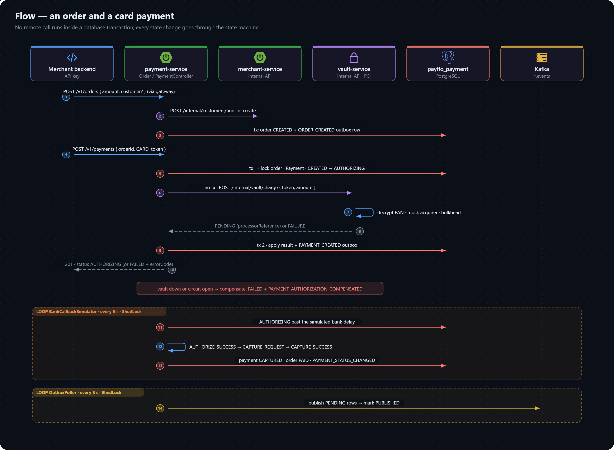

# Flow: Payment

An order and a payment, from the merchant's request to money captured. It runs in payment-service, which reaches merchant-service for customers and vault-service for cards, and never holds a database transaction open across either call.

All paths below are under `payment-service/src/main/java/com/project/payflo/payment_service/`.

## Creating an order

1. **`controller/OrderController.create`** — `POST /v1/orders`, merchant from `MerchantContext`.
2. **`service/impl/OrderServiceImpl.create`** — rejects a receipt this merchant already used (`409 ORDER_RECEIPT_DUPLICATE`); then, if the request carries a `customer` with an email, resolves it first with `client/CustomerServiceClient` → merchant-service `POST /internal/customers/find-or-create` (circuit breaker + retry). This remote call happens **before** any transaction opens.
3. **`service/impl/OrderPersistenceService.persist`** — one transaction: saves the order as `CREATED` with `attempts = 0` and `expiresAt` defaulting to 30 minutes out, and writes an `ORDER_CREATED` outbox row. The `(merchant_id, receipt)` unique index backs up the receipt check against a race (`409 DATA_INTEGRITY_VIOLATION`).

## Initiating a payment

`POST /v1/payments` is a small saga in `saga/PaymentAuthorizationRecorder`, so no remote call runs inside a transaction ([decision 0006](../decisions/0006-payment-initiation-as-a-saga.md)):

1. **Replay check.** With an `X-Idempotency-Key`, `findExistingAttempt` returns the payment already created under that key for this merchant, if any.
2. **`recordPayment` — transaction 1.** Locks the order (`findByIdAndMerchantIdForUpdate`, `SELECT … FOR UPDATE`) so concurrent attempts on one order serialize; requires it to be `CREATED` or `ATTEMPTED` (`400 ORDER_NOT_PAYABLE` otherwise); marks it `ATTEMPTED` and increments `attempts`; creates the `Payment` (`CREATED`, amount copied from the order); fires `AUTHORIZE_ATTEMPT` → `AUTHORIZING`.
3. **The gateway call — no transaction.** `gateway/PaymentGatewayRouter` picks the method's `PaymentAdapter`:
   - `CardPaymentAdapter` → vault-service `POST /internal/vault/charge` with the token and amount only; vault-service decrypts the card and runs its mock acquirer behind a bulkhead.
   - `UpiPaymentAdapter`, `NetBankingAdapter` → the local `PaymentProcessor` for that method.

   Every processor answers `Pending` (with a processor reference) or `Failure` (with an error code) — see [mock acquirer](../../api.md).
4. **`applyGatewayResult` — transaction 2.** `Pending` records the processor reference and leaves the payment `AUTHORIZING`; `Failure` fires `AUTHORIZE_FAIL` → `FAILED` with the error code. Either way a `PAYMENT_CREATED` outbox row is written.
5. **Compensation.** If step 3 throws — vault-service down, circuit open, a malformed request — `compensateAuthorizationFailure` fires `AUTHORIZE_FAIL` and writes `PAYMENT_AUTHORIZATION_COMPENSATED`, so the payment never sits in `AUTHORIZING` with no one coming to resolve it.

The response is `201` with the payment, usually `AUTHORIZING`.

## Authorization and capture

`simulator/BankCallbackSimulator` stands in for the bank's asynchronous answer. Every 5 seconds (ShedLock-guarded) it picks up `AUTHORIZING` payments older than their method's simulated delay and calls `PaymentServiceImpl.resolveAuthorization`:

- By the method's success rate (card 90%, UPI 95%, net banking 80%, or forced by `chaos-mode`), fires `AUTHORIZE_SUCCESS` → `AUTHORIZED` or `AUTHORIZE_FAIL` → `FAILED`.
- On approval it **auto-captures**: `CAPTURE_REQUEST` → `CAPTURING`, the adapter's `capture()`, then `CAPTURE_SUCCESS` → `CAPTURED` (setting `captured_at`, and the order to `PAID`) or `CAPTURE_FAIL` → back to `AUTHORIZED`.
- The outcome writes one `PAYMENT_STATUS_CHANGED` outbox row.

`POST /v1/payments/{paymentId}/capture` runs the same capture step on demand for a payment that is `AUTHORIZED`; anything else is `409 INVALID_STATE_TRANSITION`.

## Publishing

`outbox/OutboxPoller` (every 5 s, ShedLock) publishes `PENDING` outbox rows to `orders.events` / `payments.events`, keyed by merchant id, and marks each `PUBLISHED`, or `FAILED` after 3 attempts. From there, [webhook delivery](webhook-delivery.md) takes over.

## Related

- [Orders](../../api.md) and [payments](../../api.md) endpoints.
- [The payment state machine](../../schema/enums.md#payment-state-machine).
- [payment-service data model](../../schema/payment-service.md).
