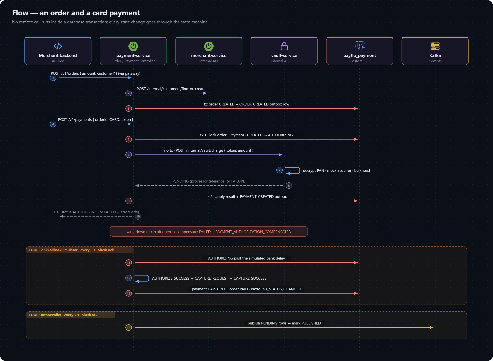

# Flow: Payment

An order and a payment, from the merchant's request to money captured. It runs in payment-service, which reaches merchant-service for customers and vault-service for cards, and never holds a database transaction open across either call.

All paths below are under `payment-service/src/main/java/com/project/payflo/payment_service/`.

## Creating an order

1. **`controller/OrderController.create`** — `POST /v1/orders`, merchant from `MerchantContext`.
2. **`service/impl/OrderServiceImpl.create`** — rejects a receipt this merchant already used (`409 ORDER_RECEIPT_DUPLICATE`); then, if the request carries a `customer` with an email, resolves it first with `client/CustomerServiceClient` → merchant-service `POST /internal/customers/find-or-create` (circuit breaker + retry). This remote call happens **before** any transaction opens.
3. **`service/impl/OrderPersistenceService.persist`** — one transaction: saves the order as `CREATED` with `attempts = 0` and `expiresAt` defaulting to 15 minutes out, and writes an `ORDER_CREATED` outbox row. The `(merchant_id, receipt)` unique index backs up the receipt check against a race (`409 DATA_INTEGRITY_VIOLATION`).

## Initiating a payment

`POST /v1/payments` is a small saga in `saga/PaymentAuthorizationRecorder`, so no remote call runs inside a transaction ([decision 0006](../decisions/0006-payment-initiation-as-a-saga.md)):

0. **Validation.** `methodDetails` must carry what the method needs (`token`, `vpa`, `bank`, `wallet`) — `400 INVALID_PAYMENT_DETAILS`. Nothing is written for a request that can never work.
1. **Replay check.** With an `X-Idempotency-Key`, `findExistingAttempt` returns the payment already created under that key for this merchant, if any.
2. **`recordPayment` — transaction 1.** Locks the order (`findByIdAndMerchantIdForUpdate`, `SELECT … FOR UPDATE`) so concurrent attempts on one order serialize; requires it to be `CREATED` or `ATTEMPTED` (`400 ORDER_NOT_PAYABLE` otherwise), not past its `expires_at` (`400 ORDER_EXPIRED`) and to have no other payment in flight or completed (`400 ORDER_PAYMENT_IN_PROGRESS` — the lock makes concurrent attempts see each other); marks it `ATTEMPTED` and increments `attempts`; creates the `Payment` (`CREATED`, amount copied from the order); fires `AUTHORIZE_ATTEMPT` → `AUTHORIZING`.
3. **The gateway call — no transaction.** `gateway/PaymentGatewayRouter` picks the method's `PaymentAdapter`:
   - `CardPaymentAdapter` → vault-service `POST /internal/vault/charge` with the paying merchant's id, the token and the amount only; vault-service charges the token only if that merchant created it, decrypts the card and runs its mock acquirer behind a bulkhead.
   - `UpiPaymentAdapter`, `NetBankingAdapter`, `WalletPaymentAdapter` → the local `PaymentProcessor` for that method.

   Every processor answers `Pending` (with a processor reference) or `Failure` (with an error code) — see [mock acquirer](../../api/mock-acquirer.md).
4. **`applyGatewayResult` — transaction 2.** `Pending` records the processor reference and leaves the payment `AUTHORIZING`; `Failure` fires `AUTHORIZE_FAIL` → `FAILED` with the error code. Either way a `PAYMENT_CREATED` outbox row is written.
5. **Compensation.** If step 3 throws, what happens depends on whether the processor could have charged:
   - **Nothing was sent** — vault-service down, the circuit open, a refused or timed-out connection: `compensateAuthorizationFailure` fires `AUTHORIZE_FAIL` and writes `PAYMENT_AUTHORIZATION_COMPENSATED`, with a fixed message (`PAYMENT_GATEWAY_ROUTER_UNREACHABLE`). An unknown, revoked or foreign card token (a `404` from vault-service) is `CARD_TOKEN_INVALID`. The exception text is logged, never stored or returned.
   - **A read timeout after the request went out** — the charge may have succeeded, so the payment is *not* failed: it stays `AUTHORIZING` (`applyGatewayResult` with no reference) and is resolved by the bank's answer or by the timeout sweeper. The card charge has no automatic retry for the same reason (`@Retry` is deliberately absent from `CardPaymentAdapter`), and the Feign clients have explicit timeouts (2 s connect, 5 s read; 8 s for vault-service) instead of Feign's 60 s default.

The response is `201` with the payment, usually `AUTHORIZING`.

## Authorization and capture

`simulator/BankCallbackSimulator` stands in for the bank's asynchronous answer. Every second (ShedLock-guarded) it picks up `AUTHORIZING` payments older than their method's simulated delay, oldest first in slices of 500 for up to 30 seconds per run, and resolves them **in batches**: `payment.simulator.batch-size` (50) payments per transaction through `PaymentServiceImpl.resolveAuthorizations`, `payment.simulator.concurrency` (4) batches at a time, on virtual threads. A batch locks its payments in one query (in id order), loads their orders in one more, applies the answer to each, and writes everything in JDBC batches with one commit, so the cost of a round trip and a log flush is shared by 50 payments instead of paid by each. If a batch fails, its payments are resolved one at a time (`resolveAuthorization`) so one bad payment cannot hold the others back. For each payment:

- By the method's success rate (card 90%, UPI 95%, net banking 80%, or forced by `chaos-mode`), fires `AUTHORIZE_SUCCESS` → `AUTHORIZED` or `AUTHORIZE_FAIL` → `FAILED`.
- On approval it **auto-captures**: `CAPTURE_REQUEST` → `CAPTURING`, the adapter's `capture()`, then `CAPTURE_SUCCESS` → `CAPTURED` (setting `captured_at`, and the order to `PAID`) or `CAPTURE_FAIL` → back to `AUTHORIZED`.
- The outcome writes one `PAYMENT_STATUS_CHANGED` outbox row.

`POST /v1/payments/{paymentId}/capture` runs the same capture step on demand for a payment that is `AUTHORIZED`; anything else is `409 INVALID_STATE_TRANSITION`. A successful manual capture marks the order `PAID` and clears the error of an attempt that failed, as the automatic one does.

A capture can be refused. `PaymentGatewayRouter.capture` asks `simulator/CaptureSimulator` first (a real adapter would return its own `Failure`); a refusal is `CAPTURE_FAIL` → back to `AUTHORIZED` with `CAPTURE_DECLINED`, the order stays `ATTEMPTED`, and the `PAYMENT_STATUS_CHANGED` event carries the `errorCode`. The order can't take another payment while the authorization is held. The merchant retries the capture, or the sweeper lapses it after 60 minutes. The test values are in the [mock acquirer](../../api/mock-acquirer.md#3-capture--the-acquirer-can-refuse-it).

## Refunds

`service/RefundService` (see [refunds](../../api/refunds.md)) is deliberately a *request*, not a remote call, so nothing slow runs in its transaction:

1. **Create** — one transaction. Locks the payment (`FOR UPDATE`, so refunds of one payment queue up), requires `CAPTURED` or `PARTIALLY_REFUNDED` (a `SETTLED` payment has been paid out and is refused), and works out what is left: the payment's amount minus every refund that is pending or processed. Saves a `Refund` in `PENDING`, fires `REFUND_INIT` (`CAPTURED` → `PARTIALLY_REFUNDED`), and writes `REFUND_CREATED` (and `PAYMENT_STATUS_CHANGED` if the status moved) to the outbox. An `X-Idempotency-Key` is stored with the refund and re-checked under the lock.
2. **Resolve** — `simulator/RefundResolver` (every 5 s, ShedLock) hands each `PENDING` refund older than `payment.refund.delay-seconds` to `RefundProcessingService`, one transaction each: it locks the payment, then the refund (the same order creation uses), and either marks it `PROCESSED` — and, if the processed refunds now equal the payment's amount, fires `REFUND_COMPLETE` (→ `REFUNDED`) — or `FAILED`, in which case the payment returns to `CAPTURED` (`REFUND_FAIL`) unless other refunds are pending or done. The outcome comes from the refund id's hash and `payment.refund.success-rate` (95%), like a payment's bank callback.
3. **Settlement** nets completed refunds off the payout; see the [settlement flow](settlement.md#refunds).

## Timeouts and expiry

`timeout/PaymentTimeoutSweeper` (every minute, ShedLock) ends what would otherwise wait forever, each item in its own transaction under a row lock and re-checked after locking (`PaymentTimeoutService`):

- `AUTHORIZING` for more than 15 minutes (`payment.timeout.authorizing-minutes`) → `AUTHORIZE_FAIL` → `FAILED`, `PAYMENT_AUTHORIZATION_TIMEOUT`. Without this, a payment stuck here also blocked its order from ever being paid again, and under `chaos-mode: TIMEOUT` the stuck payments crowded real ones out of the simulator's oldest-first slice.
- `AUTHORIZED` for more than 60 minutes (`authorized-minutes`) → `CAPTURE_TIMEOUT` → `AUTH_EXPIRED`.
- Unpaid orders (`CREATED`, `ATTEMPTED`) past `expires_at` → `EXPIRED`, publishing `ORDER_EXPIRED`; an order with a payment still in flight is left alone. Only orders that expired in the last 7 days (`order-expiry-lookback-days`) are looked at, so a long history of old unpaid orders isn't expired — and announced to webhooks — all at once.

Each publishes its own event. Cancelling an order by hand (`CANCEL`) still has no endpoint.

## Publishing

`outbox/OutboxPoller` (every second, ShedLock) publishes `PENDING` outbox rows to `orders.events` / `payments.events`, keyed by merchant id, and marks each `PUBLISHED`, or `FAILED` after 3 attempts. `outbox/OutboxMaintenance` puts `FAILED` rows back to `PENDING` after 5 minutes, so a longer Kafka outage delays events instead of stranding them (a row that can never publish is retried every 5 minutes, logged), and deletes `PUBLISHED` rows older than 7 days (`app.outbox.retention-days`), 5,000 at a time. From there, [webhook delivery](webhook-delivery.md) takes over.

## Related

- [Orders](../../api/orders.md) and [payments](../../api/payments.md) endpoints.
- [The payment state machine](../../schema/enums.md#payment-state-machine).
- [payment-service data model](../../schema/payment-service.md).
