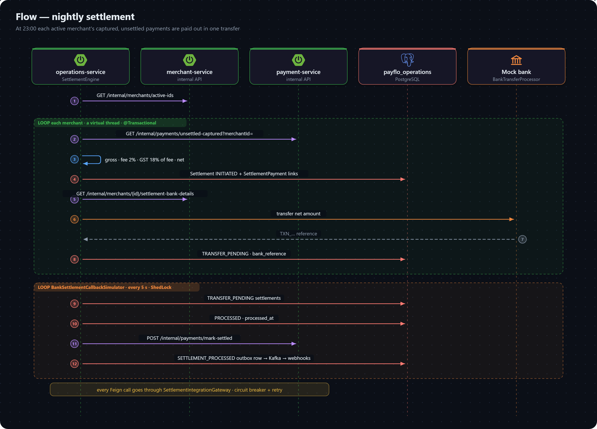

# Flow: Settlement

How merchants get paid. Every night each active merchant's captured, not-yet-settled payments are totalled, the platform fee and GST are taken off, and the rest is sent to the merchant's bank account as one transfer. It runs in operations-service, which owns settlements but reads payments and bank details from the services that own them.

All paths below are under `operations-service/src/main/java/com/project/payflo/operations_service/settlement/`.

## The nightly run

1. **`SettlementEngine`** runs at 23:00 (`@Scheduled(cron = "0 0 23 * * *")`), ShedLock-guarded with the lock held for up to 2 hours so only one instance settles. It fetches the active merchant ids from merchant-service (`GET /internal/merchants/active-ids`) and settles each merchant on its own **virtual thread**.
2. **`SettlementTransactionExecutor.processForMerchant`** (one transaction per merchant):
   - pulls the merchant's captured, unsettled payments from payment-service (`GET /internal/payments/unsettled-captured?merchantId=`); none means nothing to do;
   - computes **gross** (their sum), **fee** (2% of gross), **GST** (18% of the fee) and **net** (gross − fee − GST), rounded to whole minor units;
   - saves a `Settlement` in `INITIATED` and one `SettlementPayment` row per payment — the audit trail from payout back to payments;
   - fetches the merchant's bank account and IFSC (`GET /internal/merchants/{id}/settlement-bank-details`) and asks `BankTransferProcessor` to transfer the net amount;
   - on acceptance, stores the bank's `TXN_…` reference and moves the settlement to `TRANSFER_PENDING`; any exception along the way marks it `FAILED`.

Every call to payment- and merchant-service goes through `SettlementIntegrationGateway`, which wraps them in a circuit breaker and retry.

## The payout callback

A real bank confirms a transfer later. **`BankSettlementCallbackSimulator`** stands in for that: every 5 seconds (ShedLock-guarded) it picks up `TRANSFER_PENDING` settlements and calls `resolveTransfer`:

- **success** → `PROCESSED` with `processed_at`; payment-service marks the covered payments `SETTLED` (`POST /internal/payments/mark-settled`); a `SETTLEMENT_PROCESSED` outbox row is written;
- **failure** → `FAILED` with a `failure_reason`, and `SETTLEMENT_FAILED`.

Both events go through operations-service's own outbox to `settlements.events`, and from there through the same [webhook pipeline](webhook-delivery.md) as any other event — so merchants are notified of payouts too.

## Limits today

The simulator always reports success, refunds are not deducted (they aren't built), and a few issues found while documenting this flow — including the settlement row's non-null refund amount never being set — are listed in [known gaps](../../gaps.md).

## Related

- [Settlement status](../../schema/enums.md#settlement-status) and the [operations-service data model](../../schema/operations-service.md).
- [Internal API](../../api/internal.md) — the three endpoints settlement calls.
