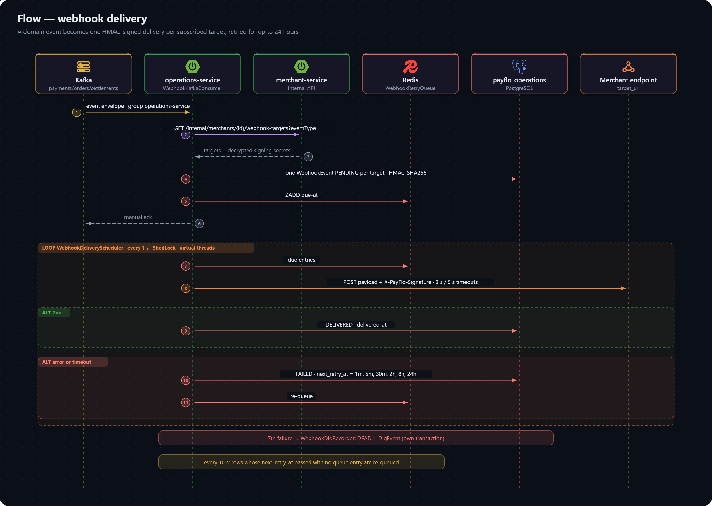

# Flow: Webhook Delivery

How PayFlo tells a merchant's own system that something happened. A domain event on Kafka becomes one signed delivery per subscribed endpoint, retried on a fixed schedule for up to 24 hours and dead-lettered after that. It runs in operations-service.

All paths below are under `operations-service/src/main/java/com/project/payflo/operations_service/`.

## From event to delivery row

1. **`webhook/WebhookKafkaConsumer`** listens on `payments.events`, `orders.events`, `refunds.events` and `settlements.events` (consumer group `operations-service`, manual acknowledgement).
2. It asks merchant-service which endpoints want this event — `client/MerchantServiceClient` → `GET /internal/merchants/{merchantId}/webhook-targets?eventType=…`. A config subscribes to a comma-separated list of event types, or to everything when the list is blank or `ALL`. The response carries each target's URL and its **decrypted** signing secret.
3. For each target it signs the payload with HMAC-SHA256 (`common-lib`'s `SignerUtil`, that target's secret) and saves a `WebhookEvent` in `PENDING` with the target URL copied in, so a later config change never rewrites history.
4. It adds each event to the Redis sorted set `webhook-retry` (`webhook/WebhookRetryQueue`), scored by when it is due, then acknowledges the Kafka record.

If processing a record fails with a database error, it is left unacknowledged so Kafka redelivers it. Any other failure — a malformed payload, merchant-service unreachable — writes the record straight to the DLQ with `WebhookDlqRecorder`, with no event link, and acknowledges it.

## Delivering

`webhook/WebhookDeliveryScheduler` drains the queue every second (ShedLock-guarded), taking up to 100 due entries and handing each to its own **virtual thread**. `webhook/WebhookDeliverExecutor` then:

- POSTs the payload to the target URL with the signature in `X-PayFlo-Signature`, a 3-second connect and 5-second read timeout;
- on a `2xx`, marks the event `DELIVERED` with `delivered_at`;
- on anything else, records the attempt (`attempts`, `last_attempt_at`, `last_response_code`, `last_response_body`), marks it `FAILED`, and schedules the next attempt after **1 min, 5 min, 30 min, 2 h, 8 h, then 24 h**;
- on the **seventh** failed attempt, hands it to `WebhookDlqRecorder`, which marks it `DEAD` and writes a `DlqEvent` with the final error and the payload, in its own transaction.

A second scheduler pass every 10 seconds re-queues any `FAILED` row whose `next_retry_at` has passed with no queue entry — covering a lost enqueue or a Redis restart.

## Trying it locally

operations-service exposes `POST /webhook/success`, a stand-in merchant endpoint that always answers `204`. Register `http://localhost:8084/webhook/success` (or `http://operations-service:8084/webhook/success` on Kubernetes) as a webhook target to watch deliveries succeed.

## Related

- [Webhook configs](../../api.md) — how merchants register endpoints.
- [Delivery status](../../schema.md) and the [operations-service data model](../../schema.md).
- [Service communication → events](../service-communication.md#events).
