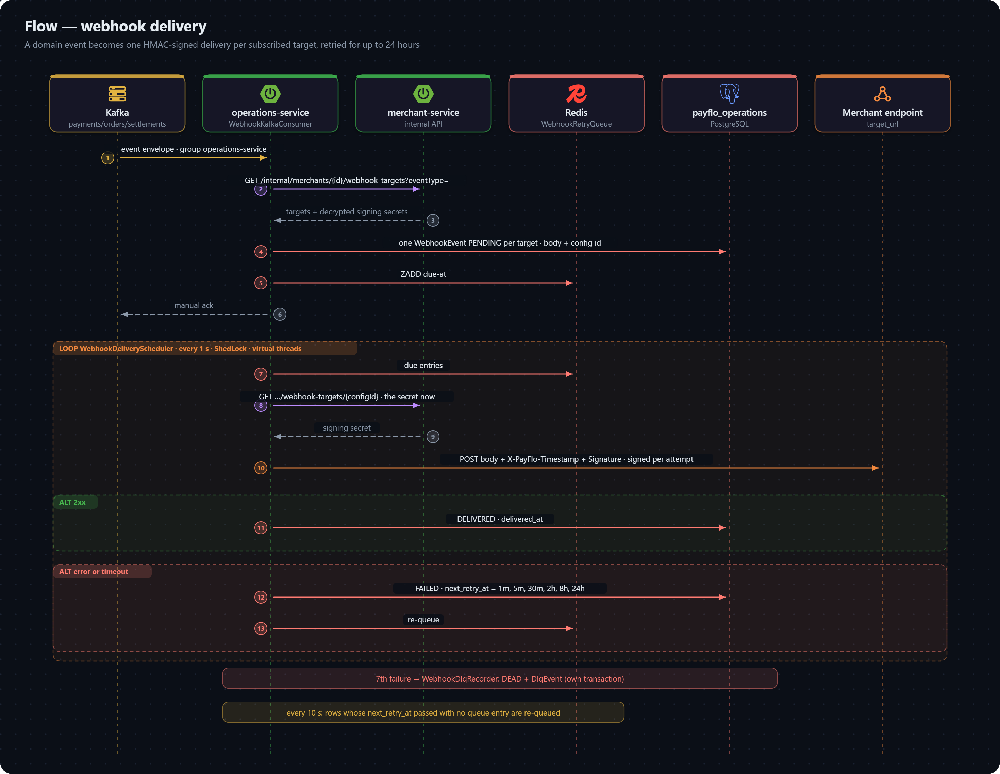

# Flow: Webhook Delivery

How PayFlo tells a merchant's own system that something happened. A domain event on Kafka becomes one signed delivery per subscribed endpoint, retried on a fixed schedule for up to 24 hours and dead-lettered after that. It runs in operations-service.

All paths below are under `operations-service/src/main/java/com/project/payflo/operations_service/`.

## From event to delivery row

1. **`webhook/WebhookKafkaConsumer`** listens on `payments.events`, `orders.events`, `refunds.events` and `settlements.events` (consumer group `operations-service`, manual acknowledgement).
2. It asks merchant-service which endpoints want this event — `webhook/WebhookTargetCache` → `client/MerchantServiceClient` → `GET /internal/merchants/{merchantId}/webhook-targets?eventType=…`. The answer is remembered in memory for `app.webhook.target-cache-ttl-seconds` (30), so a new, changed or disabled config takes up to that long to apply; a call per event capped the consumer at a few hundred events a second. A config subscribes to a comma-separated list of event types, or to everything when the list is blank or `ALL`. The response carries each target's URL and its **decrypted** signing secret.
3. For each target it signs the payload with HMAC-SHA256 (`common-lib`'s `SignerUtil`, that target's secret) and saves a `WebhookEvent` in `PENDING` with the target URL copied in, so a later config change never rewrites history.
4. It adds each event to the Redis sorted set `webhook-retry` (`webhook/WebhookRetryQueue`), scored by when it is due, then acknowledges the Kafka record.

All of a record's targets are saved in **one transaction** (`saveAll`), so a redelivery can't create a second copy for a target that already had one. A failure to queue an event in Redis doesn't fail the record: the event is saved, and the reconciler below queues it once it is overdue.

What happens when processing fails depends on what failed (`WebhookKafkaConsumer.isTransient`):

- **A dependency is down** — the database, Redis, or merchant-service (a connection error, a timeout, a `5xx`, an open circuit breaker). The record is **not acknowledged**: `nack` seeks back to it and Kafka redelivers it after 5 seconds, repeatedly, until the dependency is back. Acknowledging a later record would commit past it and lose it, which is what used to happen.
- **The record itself is bad** — a malformed payload or an unparseable id. It is written to the DLQ with `WebhookDlqRecorder`, with no event link, and acknowledged.

## Delivering

`webhook/WebhookDeliveryScheduler` drains the queue every second (ShedLock-guarded), taking up to 100 due entries and handing each to its own **virtual thread**. `webhook/WebhookDeliverExecutor` then delivers it in three steps, **with no database transaction open during the HTTP call** — a slow merchant endpoint holds a thread, not a connection, so it can't starve everyone else:

1. **Claim** (`webhook/WebhookDeliveryRecorder.claim`, a short transaction): lock the row, skip it if it is `DELIVERED`, `DEAD`, or not yet due, count the attempt, and set `next_retry_at` two minutes ahead as a **lease**. A duplicate queue entry, or the reconciler, finds it not due and backs off, so one event is never delivered twice at once.
2. **POST** the payload to the target URL with the signature in `X-PayFlo-Signature`, a 3-second connect and 5-second read timeout. The URL is validated again first ([webhook targets](../security-model.md#webhook-targets)).
3. **Record** the outcome (a second short transaction): on a `2xx`, `DELIVERED` with `delivered_at`; on anything else, `last_response_code` / `last_response_body` are saved, the status becomes `FAILED`, and the next attempt is scheduled after **1 min, 5 min, 30 min, 2 h, 8 h, then 24 h**; on the **seventh** failed attempt the event becomes `DEAD` and a `DlqEvent` with the final error and the payload is written in the same transaction.

The Redis queue is only a fast path; the database is the truth. A second scheduler pass every 10 seconds (`reconcileFromDatabase`) re-queues any **`PENDING` or `FAILED`** row whose `next_retry_at` is more than 30 seconds in the past with no queue entry — a lost enqueue, a Redis restart, or a crash mid-delivery once its lease has run out. (It used to cover only `PENDING`, so a `FAILED` event that lost its queue entry was never retried or dead-lettered.) Delivery is at-least-once: a crash after the merchant answered but before the result was saved means one more delivery, so receivers should de-duplicate.

## Trying it locally

operations-service exposes `POST /webhook/success`, a stand-in merchant endpoint that always answers `204`. Register `http://localhost:8084/webhook/success` (or `http://operations-service:8084/webhook/success` on Kubernetes) as a webhook target to watch deliveries succeed.

## Related

- [Webhook configs](../../api/webhook-configs.md) — how merchants register endpoints.
- [Delivery status](../../schema/enums.md#delivery-status) and the [operations-service data model](../../schema/operations-service.md).
- [Service communication → events](../service-communication.md#events).
