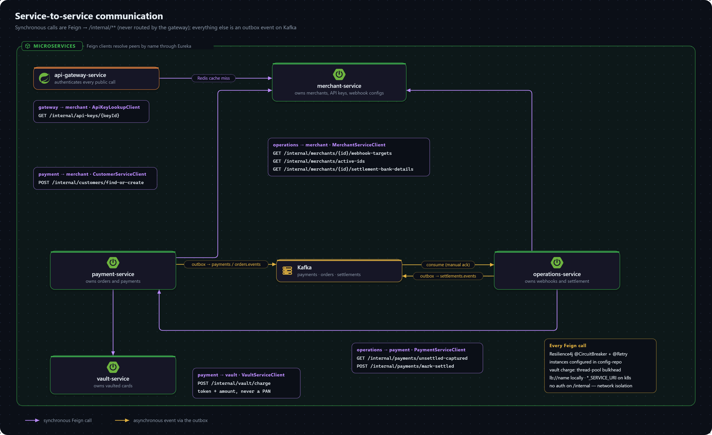

# Service Communication

Clients talk to one origin, the gateway. The services talk to each other in two ways: synchronously over a private internal API that the gateway never exposes, and asynchronously through events on Kafka.

## The gateway

`api-gateway-service` matches each request path against the route table in `config-repo/api-gateway-service.yaml` and forwards it to the owning service, resolved through Eureka:

| Path | Routed to |
|---|---|
| `/v1/auth/**`, `/v1/merchants/**` | `lb://merchant-service` |
| `/v1/orders/**`, `/v1/payments/**` | `lb://payment-service` |
| `/v1/vault/**` | `lb://vault-service` |
| `/webhook/**` | `lb://operations-service` |

- **Authentication happens here, once.** `GatewayAuthFilter` runs before routing on every request not listed in `app.security.public-routes`, and forwards the caller's identity as headers. See the [authentication flow](flows/authentication.md).
- **`/internal/**` matches no route**, so it is never reachable through the gateway.
- **There is no catch-all route.** A path no route owns is a 404 from the gateway itself.
- On Kubernetes the same routes target `http://<service>` Kubernetes Services instead of `lb://` names (`api-gateway-service-k8s.yaml`).

## Internal API

Each business service exposes `/internal/**` for the others. Callers use typed Feign clients, resolve the target by service name through Eureka, and exchange DTOs from `common-lib`'s `dto` package.

| Endpoint | Owner | Called by | Purpose |
|---|---|---|---|
| `GET /internal/api-keys/{keyId}` | merchant | gateway | Loading an API key on a Redis cache miss |
| `POST /internal/customers/find-or-create` | merchant | payment | Resolving an order's `customer` block to a customer id |
| `GET /internal/merchants/{id}/webhook-targets?eventType=` | merchant | operations | The merchant's subscribed webhook targets, with decrypted signing secrets |
| `GET /internal/merchants/active-ids` | merchant | operations | Which merchants to settle tonight |
| `GET /internal/merchants/{id}/settlement-bank-details` | merchant | operations | Where to send the payout |
| `POST /internal/vault/charge` | vault | payment | Charging a vaulted card by token — the PAN never leaves vault-service |
| `GET /internal/payments/unsettled-captured?merchantId=` | payment | operations | Captured payments not yet settled |
| `POST /internal/payments/mark-settled` | payment | operations | Marking a batch `SETTLED` once the payout succeeds |

The complete request and response shapes are in the [internal API reference](../api.md).

**Authentication.** None. These endpoints trust that only other services can reach them — true locally only by convention, and on Kubernetes because every Service except the gateway is `ClusterIP`. See the [security model](security-model.md#internal-api) and [known gaps](../gaps.md).

### Resilience

Every Feign call is wrapped in a Resilience4j `@CircuitBreaker` and `@Retry`, with instances named after the target service in each caller's `config-repo` file. The default circuit breaker opens at a 50% failure rate over a 20-call window and stays open for 10 seconds; retries make 3 attempts with backoff.

- **payment → vault** is the critical path of a card payment. If it fails, the [payment saga](flows/payment.md) compensates rather than leaving the payment in `AUTHORIZING`.
- **vault-service** runs the card processor behind a **thread-pool bulkhead** (`vault-card-processor`), so a slow acquirer can't exhaust its request threads.
- **operations-service** calls through `SettlementIntegrationGateway`, one place that wraps every settlement-related call.

### Calling another service

Adding a call between services takes three pieces: an `Internal*Controller` endpoint in the owning service, a method on the caller's Feign client in `client/`, and — if the payload is shared — a DTO in `common-lib`'s `dto` package. Two rules:

- **Keep the call outside any `@Transactional` method**, so a slow peer can't hold a database connection and row locks open. `OrderPersistenceService` and `PaymentAuthorizationRecorder` show the pattern.
- **A sealed interface crossing Feign needs a type discriminator.** `PaymentProcessorResponse` carries `@JsonTypeInfo` on a `type` property (`PENDING` / `SUCCESS` / `FAILURE`); without it Jackson can't pick the concrete record on the calling side.

## Events

Anything that can be asynchronous goes through Kafka, and every event is published through a **transactional outbox**: the service writes an `outbox_event` row in the same transaction as the domain change, and a scheduled `OutboxPoller` publishes pending rows afterward. A crash can't lose an event, and no service ever calls Kafka from a request thread. See [decision 0005](decisions/0005-transactional-outbox-for-events.md).

| Topic | Produced by | Events | Consumed by |
|---|---|---|---|
| `orders.events` | payment-service | `ORDER_CREATED` (`ORDER_CANCELLED` is written by `OrderServiceImpl.cancel`, which has no route yet) | operations-service (webhooks) |
| `payments.events` | payment-service | `PAYMENT_CREATED`, `PAYMENT_STATUS_CHANGED`, `PAYMENT_AUTHORIZATION_COMPENSATED` | operations-service (webhooks) |
| `settlements.events` | operations-service | `SETTLEMENT_PROCESSED`, `SETTLEMENT_FAILED` | operations-service (webhooks) |
| `refunds.events` | — | none yet | operations-service listens already |

The consumer group is `operations-service`, with manual acknowledgement. Events are JSON envelopes (`eventType`, `aggregateType`, `aggregateId`, `data`) with type headers off.

## Consequences of database-per-service

- **A cross-service reference is a plain id column, never a foreign key** — see [cross-service references](../schema/cross-service-references.md).
- **An internal endpoint enforces no merchant scoping of its own.** The caller has already resolved the merchant it is acting for.
- **Consistency across services is best-effort.** There are no distributed transactions; the saga and the outbox make the common paths safe. See [constraints](../gaps.md).
