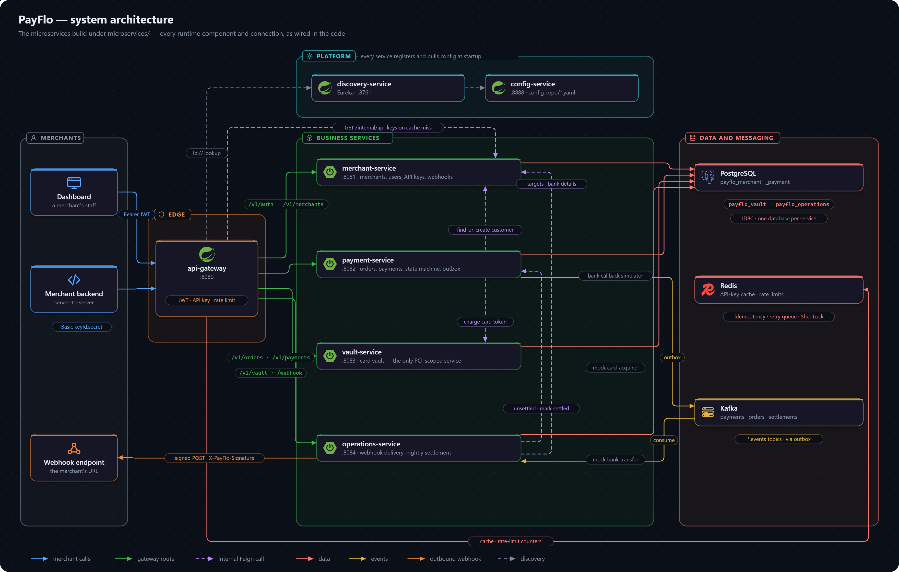

# System Context

PayFlo is a payment gateway backend — what sits behind a merchant's "Pay now" button. It is a set of Spring Boot 4.1 (Java 25) services under `microservices/`: four business services, each with its own database, behind one API gateway, with Eureka for discovery and a config server that serves settings from the repository. There is no frontend; merchants call the API from their dashboard tooling (with a JWT) or from their own backend (with an API key).

## Services

| Service | Port | Owns | Database |
|---|---|---|---|
| `api-gateway-service` | 8080 | The single public entry point: authenticates every call (JWT or API key), enforces the per-key rate limit, and routes by path. Spring Cloud Gateway Server **Web MVC**. | — |
| `discovery-service` | 8761 | Eureka. Services find each other by name (`lb://merchant-service`), not by address. | — |
| `config-service` | 8888 | Spring Cloud Config with the native backend, serving `microservices/config-repo/`. | — |
| `merchant-service` | 8081 | Merchants, dashboard users, API keys, customers, webhook configs. Issues JWTs. `/v1/auth/**`, `/v1/merchants/**`. | `payflo_merchant` |
| `payment-service` | 8082 | Orders, payments, refunds (table only), the payment state machine and transition log, the simulated bank callback. `/v1/orders/**`, `/v1/payments/**`. | `payflo_payment` |
| `vault-service` | 8083 | Card tokenization and the only decryption of card numbers; the mock card acquirer. `/v1/vault/**`. | `payflo_vault` |
| `operations-service` | 8084 | Webhook delivery (Kafka consumer → retries → DLQ) and nightly settlement. `/webhook/**` (a test endpoint only). | `payflo_operations` |
| `common-lib` | — | Not a service: shared entities (`BaseEntity`, `Money`), enums, exceptions and the error handler, `MerchantContext`, rate limiters, the idempotency filter, the API-key cache, and the DTOs services exchange. | — |

The four databases live on one PostgreSQL server. A service never reads another service's tables: anything it needs from another domain it asks for over that service's [internal API](service-communication.md#internal-api), or learns from an event on Kafka.

## Infrastructure

| System | Used for | Used by |
|---|---|---|
| PostgreSQL | System of record — one database per service, schema managed by Hibernate `ddl-auto: update` | the four business services |
| Redis | The API-key cache and rate-limit counters (gateway); idempotency keys; the webhook retry queue (operations); ShedLock locks for every scheduled job | the gateway and every business service |
| Kafka | Domain events — `payments.events`, `orders.events`, `refunds.events`, `settlements.events` — published through a transactional outbox | payment (produces), operations (produces and consumes) |
| Eureka | Service discovery by name, locally | every service |
| Config server | Every setting and development-default secret, from `config-repo/` | every service |

## What is simulated

There is no real bank or card network. Three stand-ins make the flows run end to end:

- **Mock acquirer** — `PaymentProcessor` implementations (card in vault-service; UPI and net banking in payment-service) that fail for [specific test values](../api/mock-acquirer.md) and otherwise accept.
- **Bank callback simulator** — `BankCallbackSimulator` in payment-service resolves `AUTHORIZING` payments after a per-method delay and success rate, then captures them.
- **Payout rail** — `BankTransferProcessor` and `BankSettlementCallbackSimulator` in operations-service stand in for the bank that receives settlement transfers.

## What the platform never does

A raw card number never leaves vault-service: payment-service sends a token and an amount to `POST /internal/vault/charge`, and vault-service decrypts, charges and discards the number itself. Keeping card data in one service with its own database is what keeps PCI scope small — see [decision 0004](decisions/0004-isolate-card-data-in-vault-service.md).

On Kubernetes the same services run in one namespace with Kubernetes Services in place of Eureka; see [Deployment](../deployment.md).
