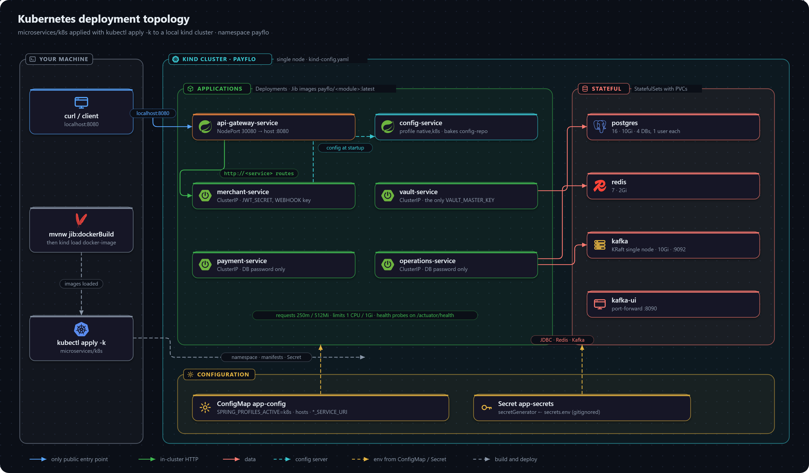

# Deployment

How PayFlo runs on Kubernetes: every service, PostgreSQL, Redis and Kafka in one namespace on a local [kind](https://kind.sigs.k8s.io/) cluster, assembled with Kustomize from `microservices/k8s/`. It runs the same code as local development, with two substitutions: **Kubernetes Services replace Eureka**, and **one PostgreSQL StatefulSet hosts all four databases**, each with its own user.

**Key properties**

- **One public entry point.** Only the gateway's Service is a `NodePort` (`30080`, published on `localhost:8080` by kind). Every other Service is `ClusterIP`, so `/internal/**` is unreachable from outside the cluster.
- **No Dockerfiles.** Images are built by Jib from each module's `pom.xml`.
- **Secrets from a gitignored file.** Kustomize's `secretGenerator` turns `k8s/secrets.env` into the `app-secrets` Secret, and each pod gets only the secrets it needs — vault-service alone gets the master key.
- **Local only.** There is no registry, CI pipeline, Ingress or autoscaling yet — see [known gaps](../known-gaps/not-yet-built.md#platform).

## Contents

| Page | Covers |
|---|---|
| [Running on kind](running-on-kind.md) | Build the images, create the cluster, deploy, use it, tear it down |
| [Kubernetes manifests](kubernetes.md) | `k8s/` layout, workloads, Services, probes, resources, the stateful components |
| [Container images](container-images.md) | How Jib builds each image, and config-service's baked-in configuration |
| [Configuration](configuration.md) | The ConfigMap, the Secret, the `k8s` profile and the `-k8s.yaml` overrides |

What was verified on a fresh cluster is listed under [testing](../practices/testing.md#what-is-verified-by-hand).
