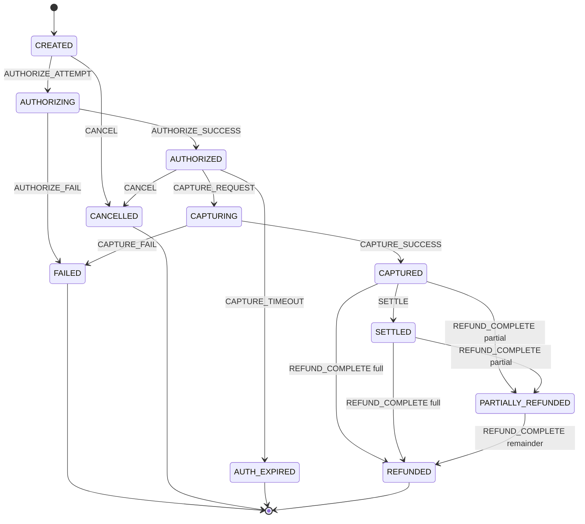
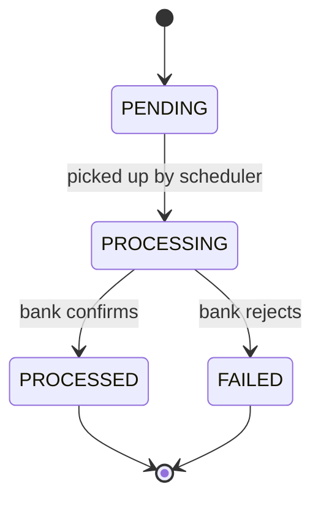

# Domain Vocabulary (Enums)

[← Back to docs index](README.md)

All enums live in `common/enums` and are persisted as strings (`@Enumerated(EnumType.STRING)`), never as
ordinals — so reordering an enum can't silently corrupt existing rows.

| Enum | Values | Used by |
|---|---|---|
| `MerchantStatus` | `PENDING_KYC`, `ACTIVE`, `SUSPENDED` | `Merchant.status` |
| `BusinessType` | `LLP`, `PROPRIETORSHIP`, `PARTNERSHIP`, `PRIVATE_LIMITED`, `PUBLIC_LIMITED`, `TRUST` | `Merchant.businessType` |
| `UserRole` | `OWNER`, `ADMIN`, `TEAM` | `AppUser.role` |
| `Environment` | `TEST`, `LIVE` | `ApiKey.environment` |
| `OrderStatus` | `CREATED`, `ATTEMPTED`, `PAID`, `CANCELLED` | `OrderRecord.orderStatus` |
| `PaymentStatus` | `CREATED`, `AUTHORIZING`, `AUTHORIZED`, `CAPTURING`, `CAPTURED`, `FAILED`, `CANCELLED`, `REFUNDED`, `PARTIALLY_REFUNDED`, `SETTLED`, `AUTH_EXPIRED` | `Payment.status`, `PaymentTransitionLog.fromStatus`/`toStatus` |
| `PaymentMethod` | `CARD`, `NETBANKING`, `UPI`, `WALLET` | `Payment.method` |
| `PaymentEvent` | `AUTHORIZE_ATTEMPT`, `AUTHORIZE_SUCCESS`, `AUTHORIZE_FAIL`, `CAPTURE_REQUEST`, `CAPTURE_SUCCESS`, `CAPTURE_FAIL`, `CAPTURE_TIMEOUT`, `REFUND_INIT`, `REFUND_COMPLETE`, `SETTLE`, `CANCEL` | `PaymentTransitionLog.event` |
| `PaymentActor` | `CUSTOMER`, `MERCHANT`, `SYSTEM` | `PaymentTransitionLog.actor` |
| `RefundStatus` | `PENDING`, `PROCESSING`, `PROCESSED`, `FAILED` | `Refund.status` |
| `CardBrand` | `VISA`, `MASTERCARD`, `RUPAY`, `AMEX` | `VaultCard.brand` |

## Payment state machine

`PaymentStatus` is the state and `PaymentEvent` is the trigger; every transition is appended to
`PAYMENT_TRANSITION_LOG` so the full history survives even though `PAYMENT.status` is overwritten in
place.

> **Not yet enforced in code.** The states and events exist as enums, but no transition-validation logic
> has been written — this diagram is the intended machine, not a description of running behaviour.

Notes:

- **`AUTHORIZING` and `CAPTURING` are in-flight states** — they exist so a request already sent to the
  acquirer is distinguishable from one not yet attempted, which is what makes a crash mid-call
  recoverable rather than ambiguous.
- **`REFUND_INIT` doesn't move the payment** — it moves `RefundStatus` from `PENDING` to `PROCESSING`.
  Only `REFUND_COMPLETE` changes the payment's own status.
- **`AUTH_EXPIRED`** covers an authorization that was never captured in time; the hold lapses at the bank
  and the money is never taken.

## Refund state machine

