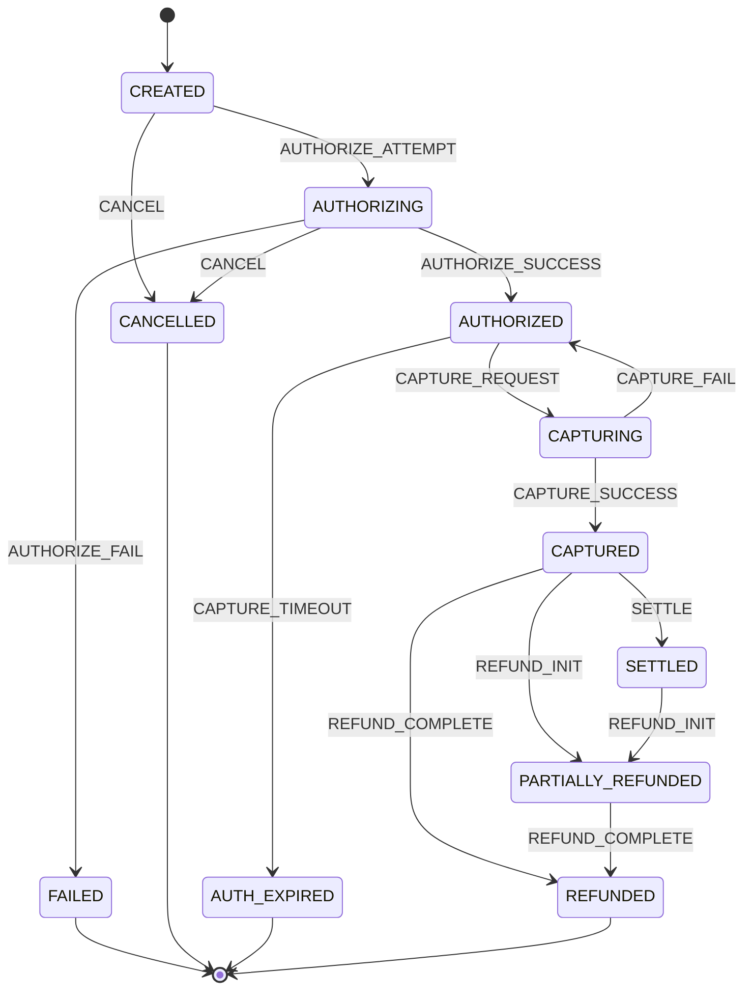
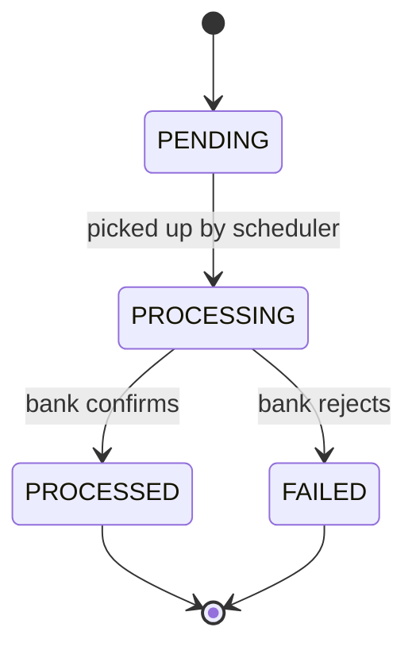

# Domain Vocabulary (Enums)

[← Back to docs index](README.md)

All enums live in `common/enums` and are persisted as strings (`@Enumerated(EnumType.STRING)`), never as
ordinals — so reordering an enum can't silently corrupt existing rows.

| Enum | Values | Used by |
|---|---|---|
| `MerchantStatus` | `PENDING_KYC`, `ACTIVE`, `SUSPENDED` | `Merchant.status` |
| `BusinessType` | `LLP`, `PROPRIETORSHIP`, `PARTNERSHIP`, `PRIVATE_LIMITED`, `PUBLIC_LIMITED`, `TRUST` | `Merchant.businessType` |
| `UserRole` | `OWNER`, `ADMIN`, `TEAM` | `AppUser.role` |
| `Environment` | `TEST`, `LIVE` | `ApiKey.environment` |
| `OrderStatus` | `CREATED`, `ATTEMPTED`, `PAID`, `CANCELLED` | `OrderRecord.orderStatus` |
| `PaymentStatus` | `CREATED`, `AUTHORIZING`, `AUTHORIZED`, `CAPTURING`, `CAPTURED`, `FAILED`, `CANCELLED`, `REFUNDED`, `PARTIALLY_REFUNDED`, `SETTLED`, `AUTH_EXPIRED` | `Payment.status`, `PaymentTransitionLog.fromStatus`/`toStatus` |
| `PaymentMethod` | `CARD`, `NETBANKING`, `UPI`, `WALLET` | `Payment.method` |
| `PaymentEvent` | `AUTHORIZE_ATTEMPT`, `AUTHORIZE_SUCCESS`, `AUTHORIZE_FAIL`, `CAPTURE_REQUEST`, `CAPTURE_SUCCESS`, `CAPTURE_FAIL`, `CAPTURE_TIMEOUT`, `REFUND_INIT`, `REFUND_COMPLETE`, `SETTLE`, `CANCEL` | `PaymentTransitionLog.event` |
| `PaymentActor` | `CUSTOMER`, `MERCHANT`, `SYSTEM` | `PaymentTransitionLog.actor` |
| `RefundStatus` | `PENDING`, `PROCESSING`, `PROCESSED`, `FAILED` | `Refund.status` |
| `CardBrand` | `VISA`, `MASTERCARD`, `RUPAY`, `AMEX` | `VaultCard.brand` |
| `SettlementStatus` | `INITIATED`, `PROCESSED`, `FAILED` | `Settlement.status` |
| `WebhookEventStatus` | `PENDING`, `DELIVERED`, `FAILED`, `DEAD` | `WebhookEvent.status` |

## Payment state machine

`PaymentStatus` is the state and `PaymentEvent` is the trigger; every transition is appended to
`PAYMENT_TRANSITION_LOG` so the full history survives even though `PAYMENT.status` is overwritten in
place.

`payment/statemachine/PaymentStateMachine` encodes this table (`transition(PaymentStatus,
PaymentEvent): PaymentStatus`, throwing `InvalidStateTransitionException` — mapped to `409
Conflict` with code `INVALID_STATE_TRANSITION` by `GlobalExceptionHandler` — for an undefined
pair). `payment/statemachine/PaymentTransitionService.apply(Payment, PaymentEvent)` wraps it: looks
up the next status, writes a `PaymentTransitionLog` row (`fromStatus`/`event`/`toStatus`/`actor` —
`actor` is currently always hardcoded to `PaymentActor.SYSTEM`, see [Known
gaps](gaps.md)), and sets `Payment.status`. `PaymentServiceImpl`
now goes through this for every transition it makes: `initiate` fires `AUTHORIZE_ATTEMPT` before
dispatching to the gateway and `AUTHORIZE_FAIL` on a `Failure` result; `capture` fires
`CAPTURE_REQUEST` before dispatching to the processor and `CAPTURE_SUCCESS`/`CAPTURE_FAIL` on the
result (a `Pending` or `null` capture result still sets `status` directly rather than through the
service, since there's no `PaymentEvent` modeling "still pending"/"adapter not implemented"). The
diagram below reflects the component's actual transition table, which has revised two things from
the previously-documented version:

- A failed capture now reverts to `AUTHORIZED` (retryable) instead of going straight to a terminal
  `FAILED` — this already matches what the shipped `POST /v1/payments/{paymentId}/capture` does
  (see [APIs](api.md)), so this brings the diagram in line with already-running behavior.
- **The refund lifecycle changed shape.** `REFUND_INIT` now moves the payment itself to
  `PARTIALLY_REFUNDED` (used as a general "refund in progress" marker, from either `CAPTURED` or
  `SETTLED`), and `REFUND_COMPLETE` finishes it by moving to `REFUNDED` — every refund goes through
  an in-progress step before completing, rather than the previous model of two separate direct
  edges (`REFUND_COMPLETE partial` vs. `REFUND_COMPLETE full`) with `REFUND_INIT` only touching
  `RefundStatus`, never `PaymentStatus`.

Notes:

- **`AUTHORIZING` and `CAPTURING` are in-flight states** — they exist so a request already sent to the
  acquirer is distinguishable from one not yet attempted, which is what makes a crash mid-call
  recoverable rather than ambiguous.
- **A failed capture is retryable, not terminal** — `CAPTURING --CAPTURE_FAIL--> AUTHORIZED`, not
  `FAILED`, so a transient acquirer error doesn't kill the payment; it can be captured again.
- **`REFUND_INIT` now moves the payment to `PARTIALLY_REFUNDED`** as an in-progress marker (from
  `CAPTURED` or `SETTLED`); `REFUND_COMPLETE` is what actually finishes it, moving to `REFUNDED`.
  There's no direct `SETTLED --> REFUNDED` edge — a full refund on a settled payment still passes
  through `PARTIALLY_REFUNDED` first.
- **`AUTH_EXPIRED`** covers an authorization that was never captured in time; the hold lapses at the bank
  and the money is never taken.

## Refund state machine

