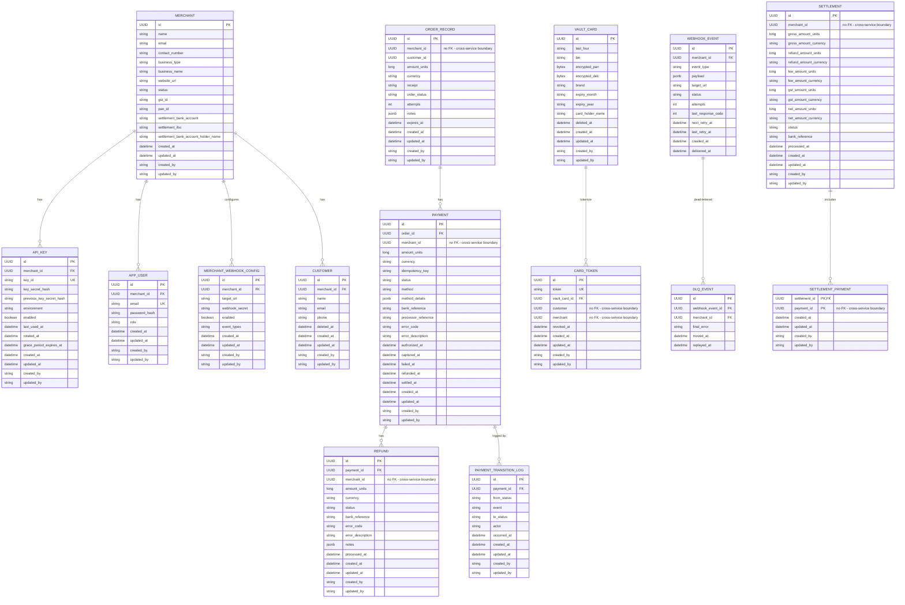

# Entities

[← Back to docs index](README.md)

13 of 15 entities are now implemented as JPA entities (no repositories/services/controllers yet — just
the persistence layer). The other 2 remain design-only, unchanged from the original plan.

- **Implemented:** `MERCHANT`, `API_KEY`, `APP_USER`, `MERCHANT_WEBHOOK_CONFIG`, `CUSTOMER`,
  `ORDER_RECORD`, `PAYMENT`, `REFUND`, `PAYMENT_TRANSITION_LOG`, `VAULT_CARD`, `CARD_TOKEN`,
  `SETTLEMENT`, `SETTLEMENT_PAYMENT`
- **Planned, not yet built:** `WEBHOOK_EVENT`, `DLQ_EVENT`

## Entity Relationship Diagram (v2)

Implemented entities reflect the actual JPA schema. Planned entities are unchanged from the v1 design.

## Entity Details

Common columns that recur across most entities: `id` (primary key) and, since all 8 implemented entities
extend a shared `BaseEntity` base class, `created_at`/`updated_at`/`created_by`/`updated_by`. Note:
`created_by`/`updated_by` won't actually populate until Spring Data JPA auditing is wired up
(`@EnableJpaAuditing` + an `AuditorAware` bean — neither exists yet), so those two columns are always
null today. Money fields use a shared `Money` embeddable value type (`amount_units` + `currency`) rather
than a flat `_paise` column, so an amount always carries its currency with it; the amount is a `long`
count of the smallest currency unit (paise for INR), never a floating-point value, so money arithmetic
can't accumulate rounding error. `ORDER_RECORD`, `PAYMENT`, and `REFUND`
store `merchant_id` as a plain UUID with **no foreign key** to `MERCHANT` — deliberate, anticipating a
future microservices split where merchant-service and payment-service each own their own database, so no
real cross-database FK would be possible anyway.

### MERCHANT

A business onboarded onto the platform; owns its own settlement bank details and KYC fields.

| Field | Meaning |
|---|---|
| `id` | Primary key. |
| `name` | Merchant's display/trading name. |
| `email` | Merchant's primary contact email — distinct from individual `APP_USER` login emails. |
| `contact_number` | Merchant's contact phone number. |
| `business_type` | Legal structure of the business (LLP, proprietorship, partnership, private/public limited, trust). |
| `business_name` | Registered legal entity name (may differ from the trading name). |
| `website_url` | Merchant's website, if any. |
| `status` | Account lifecycle state — pending KYC, active, or suspended. |
| `gst_id` | GST registration number, part of tax KYC. |
| `pan_id` | PAN (tax ID) of the business, part of KYC. |
| `settlement_bank_account` | Bank account number payouts are sent to. |
| `settlement_ifsc` | IFSC code (bank branch identifier) for the settlement account. |
| `settlement_bank_account_holder_name` | Name on the settlement account, used to verify it matches the merchant. |
| `created_at` / `updated_at` / `created_by` / `updated_by` | Inherited from `BaseEntity`. |

### API_KEY

Merchant-scoped API credentials, with support for rotation without breaking existing integrations.

| Field | Meaning |
|---|---|
| `id` | Primary key. |
| `merchant_id` | Which merchant owns this key. |
| `key_id` | The public identifier half of the key — safe to display, like a username for the key. |
| `key_secret_hash` | Hash of the secret half; the real secret is never stored, only shown once at creation. |
| `previous_key_secret_hash` | The prior secret's hash, kept during rotation so a key can still authenticate on either the old or new secret through the grace period. |
| `environment` | e.g. test vs live, so sandbox and production credentials stay separate. |
| `enabled` | Whether the key currently works. |
| `last_used_at` | Last time this key authenticated a request — useful for spotting stale/unused keys. |
| `rotated_at` | When the key was last rotated (replaced with a new secret). |
| `grace_period_expires_at` | After rotation, the old key can keep working briefly so in-flight integrations don't break instantly; this is when that grace period ends. |
| `created_at` / `updated_at` / `created_by` / `updated_by` | Inherited from `BaseEntity`. |

> **Gap vs. v1 design:** no `webhook_secret_hash` field — was in the original plan, not present in the entity yet.

### APP_USER

A human user with dashboard login access, belonging to one merchant.

| Field | Meaning |
|---|---|
| `id` | Primary key. |
| `merchant_id` | Which merchant this dashboard user belongs to. |
| `email` | Login email, unique per user. |
| `password_hash` | Hashed login password. |
| `role` | Permission level within the merchant's dashboard (owner, admin, or team). |
| `created_at` / `updated_at` / `created_by` / `updated_by` | Inherited from `BaseEntity`. |

### MERCHANT_WEBHOOK_CONFIG

Per-merchant configuration of where and what webhook events get sent.

| Field | Meaning |
|---|---|
| `id` | Primary key. |
| `merchant_id` | Owning merchant. |
| `target_url` | The merchant's endpoint that PayFlo calls on events. |
| `webhook_secret` | Secret used to HMAC-sign payloads sent to this URL, so the merchant can verify authenticity. |
| `enabled` | Whether delivery to this endpoint is currently active. |
| `event_types` | Comma-separated list of event types this config subscribes to. |
| `created_at` / `updated_at` / `created_by` / `updated_by` | Inherited from `BaseEntity`. |

### CUSTOMER

An end customer of a merchant — customers are scoped to a single merchant, not shared across merchants.

| Field | Meaning |
|---|---|
| `id` | Primary key. |
| `merchant_id` | Owning merchant. |
| `name` / `email` / `phone` | Contact details. |
| `deleted_at` | Soft-delete timestamp — set instead of removing the row, so a deleted customer's history stays intact. |
| `created_at` / `updated_at` / `created_by` / `updated_by` | Inherited from `BaseEntity`. |

> **Gap vs. v1 design:** no `gst_id` field — was in the original plan, not present in the entity yet.

### ORDER_RECORD

A payable order created by a merchant; a payment is always initiated against one of these.

| Field | Meaning |
|---|---|
| `id` | Primary key. |
| `merchant_id` | Owning merchant — no FK (cross-service boundary, see note above). |
| `customer_id` | The customer this order is for. |
| `amount_units` / `currency` | Order amount, via the shared `Money` value type. |
| `receipt` | Merchant-supplied receipt/reference label for the order. |
| `order_status` | Order lifecycle status (created, attempted, paid, cancelled). |
| `attempts` | How many payment attempts have been made against this order. |
| `notes` | Free-form merchant-supplied metadata (JSON). |
| `expires_at` | When the order auto-expires if unpaid. |
| `created_at` / `updated_at` / `created_by` / `updated_by` | Inherited from `BaseEntity`. |

> **Gap vs. requirements:** no `idempotency_key` field — the "idempotent order creation via
> `X-Idempotent-Header`" functional requirement isn't backed by the entity yet.

### PAYMENT

A single payment attempt against an order.

| Field | Meaning |
|---|---|
| `id` | Primary key. |
| `order_id` | The order this payment attempt is for. |
| `merchant_id` | Owning merchant — no FK (cross-service boundary, see note above). |
| `amount_units` / `currency` | Payment amount, via the shared `Money` value type. |
| `idempotency_key` | Duplicate-prevention key for payment initiation. |
| `status` | State-machine status — see `PaymentStatus` (created, authorizing, authorized, capturing, captured, failed, cancelled, refunded, partially refunded, settled, auth-expired). |
| `method` | Payment method used — card, UPI, net banking, or wallet. |
| `method_details` | Method-specific data (JSON), e.g. masked card info or a UPI VPA. |
| `bank_reference` | Reference/transaction ID returned by the (mock) acquirer/bank. |
| `processor_reference` | A separate reference ID from the payment processor, distinct from the bank's own reference. |
| `error_code` / `error_description` | Populated when the payment fails. |
| `authorized_at` | When the payment was authorized. |
| `captured_at` | When funds were actually captured. |
| `failed_at` | When the payment failed, if it did. |
| `refunded_at` | When the payment was (fully) refunded, if it was. |
| `settled_at` | When this payment was included in a settlement payout. |
| `created_at` / `updated_at` / `created_by` / `updated_by` | Inherited from `BaseEntity`. |

> **Gap vs. v1 design:** no running `refunded_amount` total on the payment itself — partial-refund
> tracking would currently need to be derived by summing the linked `REFUND` rows instead.

### REFUND

A refund issued against a payment (full or partial).

| Field | Meaning |
|---|---|
| `id` | Primary key. |
| `payment_id` | The payment being refunded. |
| `merchant_id` | Owning merchant — no FK (cross-service boundary, see note above). |
| `amount_units` / `currency` | Refund amount, via the shared `Money` value type — may be less than the full payment amount. |
| `status` | Refund state-machine status (pending, processing, processed, failed). |
| `bank_reference` | Reference ID for the refund transfer. |
| `error_code` / `error_description` | Populated when the refund fails. |
| `notes` | Free-form metadata (JSON). |
| `processed_at` | When the refund was actually processed (by the scheduler/bank). |
| `created_at` / `updated_at` / `created_by` / `updated_by` | Inherited from `BaseEntity`. |

### PAYMENT_TRANSITION_LOG

Audit trail of every status change a payment goes through — so history isn't lost when `status` is
overwritten on the `PAYMENT` row itself.

| Field | Meaning |
|---|---|
| `id` | Primary key. |
| `payment_id` | Which payment this transition belongs to. |
| `from_status` / `to_status` | The state change being recorded (`PaymentStatus`). |
| `event` | What triggered the transition — a `PaymentEvent` (e.g. `AUTHORIZE_SUCCESS`, `CAPTURE_FAIL`, `REFUND_INIT`), not a free-form string. |
| `actor` | Who or what caused it — `CUSTOMER`, `MERCHANT`, or `SYSTEM`. |
| `occurred_at` | When the transition happened. |
| `created_at` / `updated_at` / `created_by` / `updated_by` | Inherited from `BaseEntity`. |

> **Gap vs. v1 design:** no `reason` field — the human-readable explanation (especially useful for
> failures) that was in the original plan isn't present on the entity yet.

### VAULT_CARD

Encrypted card data at rest. Never exposed directly — always accessed indirectly via a `CARD_TOKEN`.

| Field | Meaning |
|---|---|
| `id` | Primary key. |
| `last_four` | Last 4 digits of the card — safe to display without decrypting anything. |
| `bin` | Bank Identification Number (first 6 digits) — identifies the issuing bank/card type. |
| `encrypted_pan` | The full card number, encrypted — never stored or read in plain text. |
| `encrypted_dek` | The Data Encryption Key used to encrypt the PAN, itself encrypted (envelope encryption — each card gets its own key, and that key is protected by a master key, limiting the damage if one key is ever compromised). |
| `brand` | Card network — one of `CardBrand` (`VISA`, `MASTERCARD`, `RUPAY`, `AMEX`). |
| `expiry_month` / `expiry_year` | Card expiry, stored as strings. |
| `card_holder_name` | Name on the card. |
| `deleted_at` | Soft-delete timestamp. |
| `created_at` / `updated_at` / `created_by` / `updated_by` | Inherited from `BaseEntity`. |

### CARD_TOKEN

The opaque, safe-to-reference token that stands in for a vaulted card.

| Field | Meaning |
|---|---|
| `id` | Primary key. |
| `token` | The opaque value merchants/customers actually reference instead of the real card. |
| `vault_card_id` | Links back to the actual encrypted card data (`@ManyToOne` to `VAULT_CARD`). |
| `customer` | Which customer this token belongs to — plain UUID, no FK (cross-service boundary). |
| `merchant` | Owning merchant — plain UUID, no FK (cross-service boundary). |
| `revoked_at` | When this token was revoked, if it has been. |
| `created_at` / `updated_at` / `created_by` / `updated_by` | Inherited from `BaseEntity`. |

### WEBHOOK_EVENT

_Planned, not yet implemented._

A single outbound webhook delivery attempt (and its retry bookkeeping).

| Field | Meaning |
|---|---|
| `id` | Primary key. |
| `merchant_id` | Owning merchant. |
| `event_type` | What happened, e.g. `payment.captured`, `refund.processed`. |
| `payload` | The actual event data sent to the merchant (JSON). |
| `target_url` | Where it was sent — copied from the webhook config at send time, so later config changes don't rewrite history. |
| `status` | Delivery status (pending, delivered, failed, dead-lettered). |
| `attempts` | How many delivery attempts have been made so far. |
| `last_response_code` | HTTP status code returned by the merchant's endpoint on the last attempt. |
| `next_retry_at` | When the next retry is scheduled. |
| `last_retry_at` | When the last retry happened. |
| `created_at` | When the event was created. |
| `delivered_at` | When it was successfully delivered, if it was. |

### DLQ_EVENT

_Planned, not yet implemented._

A webhook event that exhausted its retries and was dead-lettered.

| Field | Meaning |
|---|---|
| `id` | Primary key. |
| `webhook_event_id` | The webhook event that exhausted its retries. |
| `merchant_id` | Owning merchant. |
| `final_error` | The error recorded on the last failed attempt, kept for debugging. |
| `moved_at` | When it was moved into the DLQ. |
| `replayed_at` | When (if) it was manually replayed. |

### SETTLEMENT

A payout batch to a merchant's bank account.

| Field | Meaning |
|---|---|
| `id` | Primary key. |
| `merchant_id` | Owning merchant — plain UUID, no FK (cross-service boundary). |
| `gross_amount_units` / `gross_amount_currency` | Total payment amount before any deductions. |
| `refund_amount_units` / `refund_amount_currency` | Refunds deducted in this settlement. |
| `fee_amount_units` / `fee_amount_currency` | Platform fee deducted. |
| `gst_amount_units` / `gst_amount_currency` | Tax deducted. |
| `net_amount_units` / `net_amount_currency` | What's actually paid out: gross − refunds − fee − GST. |
| `status` | Settlement batch status — one of `SettlementStatus` (`INITIATED`, `PROCESSED`, `FAILED`). |
| `bank_reference` | Reference from the (mock) bank transfer. |
| `processed_at` | When the payout was processed. |
| `created_at` / `updated_at` / `created_by` / `updated_by` | Inherited from `BaseEntity`. |

> Diverges from the v1 design: each of the five amounts is a separate embedded `Money` (its own
> `_units` + `_currency` column pair) rather than one amount set sharing a single `currency` column.

### SETTLEMENT_PAYMENT

Join table linking a settlement batch to the individual payments it includes — this is what makes a
payout traceable back to the exact payments it covers (the audit trail mentioned under Settlement
requirements).

| Field | Meaning |
|---|---|
| `settlement_id` | Part of the composite primary key (`SettlementPaymentId`); the settlement batch, `@ManyToOne` to `SETTLEMENT`. |
| `payment_id` | Part of the composite primary key; a payment included in that batch — plain UUID, no FK (cross-service boundary). |
| `created_at` / `updated_at` / `created_by` / `updated_by` | Inherited from `BaseEntity`. |
