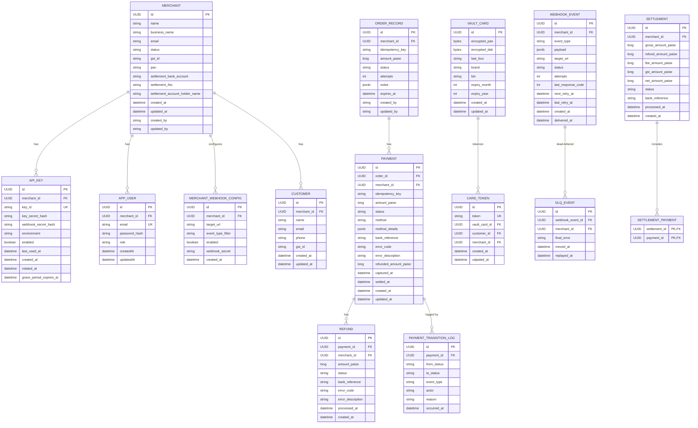

# Entities

[← Back to docs index](README.md)

Domain model designed; not yet implemented in code (no JPA entities/migrations exist yet — this is the
target schema).

## Entity Relationship Diagram (v1)

## Entity Details

Common columns that recur across most entities: `id` (primary key), `created_at`/`updated_at`
(record lifecycle timestamps), and on a few entities `created_by`/`updated_by` (which actor made the
change). These are still listed per entity below for completeness, just kept brief since the meaning
doesn't change entity to entity. Money fields are consistently stored as `_paise` (integer, smallest
currency unit) rather than a decimal rupee amount, to avoid floating-point rounding errors on money.

### MERCHANT

A business onboarded onto the platform; owns its own settlement bank details and KYC fields.

| Field | Meaning |
|---|---|
| `Id` | Primary key. |
| `name` | Merchant's display/trading name. |
| `business_name` | Registered legal entity name (may differ from the trading name). |
| `email` | Merchant's primary contact email — distinct from individual `APP_USER` login emails. |
| `status` | Account lifecycle state, e.g. pending KYC, active, suspended. |
| `gst_id` | GST registration number, part of tax KYC. |
| `pan` | PAN (tax ID) of the business, part of KYC. |
| `settlement_bank_account` | Bank account number payouts are sent to. |
| `settlement_ifsc` | IFSC code (bank branch identifier) for the settlement account. |
| `settlement_account_holder_name` | Name on the settlement account, used to verify it matches the merchant. |
| `created_at` / `updated_at` | Record lifecycle timestamps. |
| `created_by` / `updated_by` | Which actor (admin/system) created or last modified the record. |

### API_KEY

Merchant-scoped API credentials, with support for rotation without breaking existing integrations.

| Field | Meaning |
|---|---|
| `id` | Primary key. |
| `merchant_id` | Which merchant owns this key. |
| `key_id` | The public identifier half of the key — safe to display, like a username for the key. |
| `key_secret_hash` | Hash of the secret half; the real secret is never stored, only shown once at creation. |
| `webhook_secret_hash` | Hash of the secret used to sign/verify webhook-related calls tied to this key. |
| `environment` | e.g. test vs live, so sandbox and production credentials stay separate. |
| `enabled` | Whether the key currently works. |
| `last_used_at` | Last time this key authenticated a request — useful for spotting stale/unused keys. |
| `created_at` | When the key was created. |
| `rotated_at` | When the key was last rotated (replaced with a new secret). |
| `grace_period_expires_at` | After rotation, the old key can keep working briefly so in-flight integrations don't break instantly; this is when that grace period ends. |

### APP_USER

A human user with dashboard login access, belonging to one merchant.

| Field | Meaning |
|---|---|
| `id` | Primary key. |
| `merchant_id` | Which merchant this dashboard user belongs to. |
| `email` | Login email, unique per user. |
| `password_hash` | Hashed login password. |
| `role` | Permission level within the merchant's dashboard (e.g. admin, viewer). |
| `createdAt` / `updatedAt` | Record lifecycle timestamps. |

### MERCHANT_WEBHOOK_CONFIG

Per-merchant configuration of where and what webhook events get sent.

| Field | Meaning |
|---|---|
| `id` | Primary key. |
| `merchant_id` | Owning merchant. |
| `target_url` | The merchant's endpoint that PayFlo calls on events. |
| `event_type_filter` | Which event types this config should receive, so a merchant isn't sent events it doesn't care about. |
| `enabled` | Whether delivery to this endpoint is currently active. |
| `webhook_secret` | Secret used to HMAC-sign payloads sent to this URL, so the merchant can verify authenticity. |
| `created_at` | When the config was created. |

### CUSTOMER

An end customer of a merchant — customers are scoped to a single merchant, not shared across merchants.

| Field | Meaning |
|---|---|
| `id` | Primary key. |
| `merchant_id` | Owning merchant. |
| `name` / `email` / `phone` | Contact details. |
| `gst_id` | Customer's own GST ID, if the customer is itself a business (B2B). |
| `created_at` / `updated_at` | Record lifecycle timestamps. |

### ORDER_RECORD

A payable order created by a merchant; a payment is always initiated against one of these.

| Field | Meaning |
|---|---|
| `id` | Primary key. |
| `merchant_id` | Owning merchant. |
| `idempotency_key` | Client-supplied key used to detect and collapse duplicate create requests. |
| `amount_paise` | Order amount, in paise. |
| `status` | Order lifecycle status (e.g. created, paid, expired). |
| `attempts` | How many payment attempts have been made against this order. |
| `notes` | Free-form merchant-supplied metadata (JSON). |
| `expires_at` | When the order auto-expires if unpaid. |
| `created_by` / `updated_by` | Which actor created or last modified the order. |

### PAYMENT

A single payment attempt against an order.

| Field | Meaning |
|---|---|
| `id` | Primary key. |
| `order_id` | The order this payment attempt is for. |
| `merchant_id` | Owning merchant. |
| `idempotency_key` | Same duplicate-prevention idea as on orders, applied to payment initiation. |
| `amount_paise` | Payment amount, in paise. |
| `status` | State-machine status (e.g. initiated, authorized, captured, failed). |
| `method` | Payment method used — card, UPI, net banking, or wallet. |
| `method_details` | Method-specific data (JSON), e.g. masked card info or a UPI VPA. |
| `bank_reference` | Reference/transaction ID returned by the (mock) acquirer/bank. |
| `error_code` / `error_description` | Populated when the payment fails. |
| `refunded_amount_paise` | Running total refunded against this payment so far — supports partial refunds. |
| `captured_at` | When funds were actually captured. |
| `settled_at` | When this payment was included in a settlement payout. |
| `created_at` / `updated_at` | Record lifecycle timestamps. |

### REFUND

A refund issued against a payment (full or partial).

| Field | Meaning |
|---|---|
| `id` | Primary key. |
| `payment_id` | The payment being refunded. |
| `merchant_id` | Owning merchant. |
| `amount_paise` | Refund amount, in paise — may be less than the full payment amount. |
| `status` | Refund state-machine status. |
| `bank_reference` | Reference ID for the refund transfer. |
| `error_code` / `error_description` | Populated when the refund fails. |
| `processed_at` | When the refund was actually processed (by the scheduler/bank). |
| `created_at` | When the refund was requested. |

### PAYMENT_TRANSITION_LOG

Audit trail of every status change a payment goes through — so history isn't lost when `status` is
overwritten on the `PAYMENT` row itself.

| Field | Meaning |
|---|---|
| `id` | Primary key. |
| `payment_id` | Which payment this transition belongs to. |
| `from_status` / `to_status` | The state change being recorded. |
| `event_type` | What triggered the transition, e.g. an acquirer callback or a manual action. |
| `actor` | Who or what caused it — system, a specific user, the scheduler, etc. |
| `reason` | Human-readable explanation, especially useful for failures. |
| `occurred_at` | When the transition happened. |

### VAULT_CARD

Encrypted card data at rest. Never exposed directly — always accessed indirectly via a `CARD_TOKEN`.

| Field | Meaning |
|---|---|
| `id` | Primary key. |
| `encrypted_pan` | The full card number, encrypted — never stored or read in plain text. |
| `encrypted_dek` | The Data Encryption Key used to encrypt the PAN, itself encrypted (envelope encryption — each card gets its own key, and that key is protected by a master key, limiting the damage if one key is ever compromised). |
| `last_four` | Last 4 digits of the card — safe to display without decrypting anything. |
| `brand` | Card network (Visa, Mastercard, etc.). |
| `bin` | Bank Identification Number (first 6–8 digits) — identifies the issuing bank/card type. |
| `expiry_month` / `expiry_year` | Card expiry. |
| `created_at` / `updated_at` | Record lifecycle timestamps. |

### CARD_TOKEN

The opaque, safe-to-reference token that stands in for a vaulted card.

| Field | Meaning |
|---|---|
| `id` | Primary key. |
| `token` | The opaque value merchants/customers actually reference instead of the real card. |
| `vault_card_id` | Links back to the actual encrypted card data. |
| `customer_id` | Which customer this token belongs to. |
| `merchant_id` | Owning merchant — scoping so one merchant can't use another merchant's customer's token. |
| `created_at` / `updated_at` | Record lifecycle timestamps. |

### WEBHOOK_EVENT

A single outbound webhook delivery attempt (and its retry bookkeeping).

| Field | Meaning |
|---|---|
| `id` | Primary key. |
| `merchant_id` | Owning merchant. |
| `event_type` | What happened, e.g. `payment.captured`, `refund.processed`. |
| `payload` | The actual event data sent to the merchant (JSON). |
| `target_url` | Where it was sent — copied from the webhook config at send time, so later config changes don't rewrite history. |
| `status` | Delivery status (pending, delivered, failed, dead-lettered). |
| `attempts` | How many delivery attempts have been made so far. |
| `last_response_code` | HTTP status code returned by the merchant's endpoint on the last attempt. |
| `next_retry_at` | When the next retry is scheduled. |
| `last_retry_at` | When the last retry happened. |
| `created_at` | When the event was created. |
| `delivered_at` | When it was successfully delivered, if it was. |

### DLQ_EVENT

A webhook event that exhausted its retries and was dead-lettered.

| Field | Meaning |
|---|---|
| `id` | Primary key. |
| `webhook_event_id` | The webhook event that exhausted its retries. |
| `merchant_id` | Owning merchant. |
| `final_error` | The error recorded on the last failed attempt, kept for debugging. |
| `moved_at` | When it was moved into the DLQ. |
| `replayed_at` | When (if) it was manually replayed. |

### SETTLEMENT

A payout batch to a merchant's bank account.

| Field | Meaning |
|---|---|
| `id` | Primary key. |
| `merchant_id` | Owning merchant. |
| `gross_amount_paise` | Total payment amount before any deductions. |
| `refund_amount_paise` | Refunds deducted in this settlement. |
| `fee_amount_paise` | Platform fee deducted. |
| `gst_amount_paise` | Tax deducted. |
| `net_amount_paise` | What's actually paid out: gross − refunds − fee − GST. |
| `status` | Settlement batch status. |
| `bank_reference` | Reference from the (mock) bank transfer. |
| `processed_at` | When the payout was processed. |
| `created_at` | When the settlement batch was created. |

### SETTLEMENT_PAYMENT

Join table linking a settlement batch to the individual payments it includes — this is what makes a
payout traceable back to the exact payments it covers (the audit trail mentioned under Settlement
requirements).

| Field | Meaning |
|---|---|
| `settlement_id` | Part of the composite primary key; the settlement batch. |
| `payment_id` | Part of the composite primary key; a payment included in that batch. |
