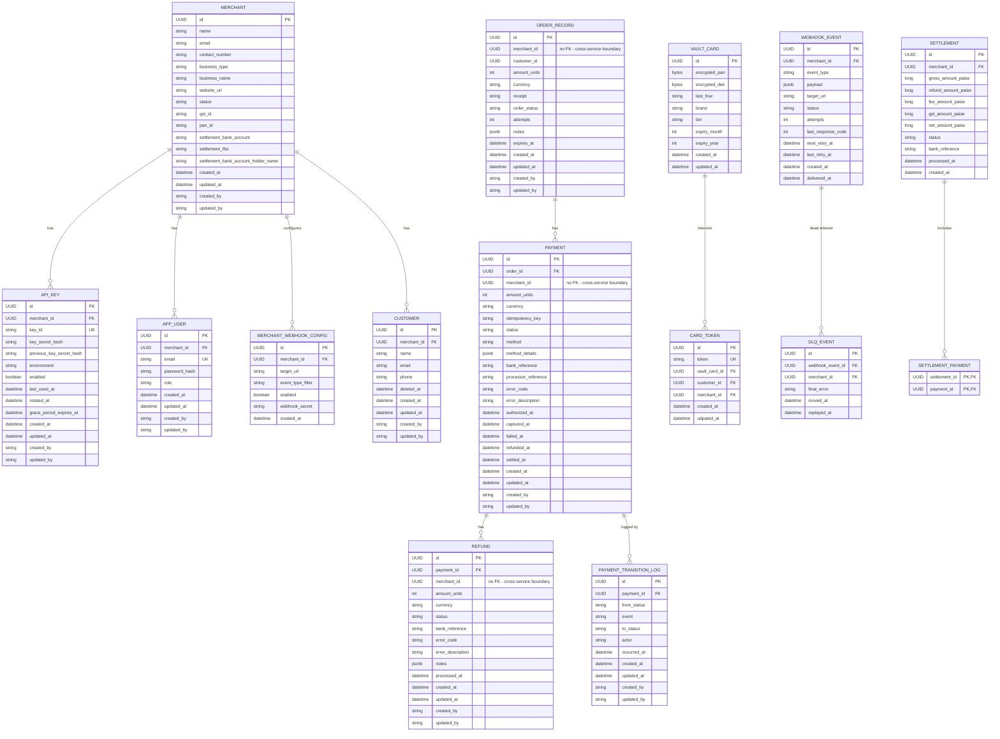

# Entities

[← Back to docs index](README.md)

8 of 15 entities are now implemented as JPA entities (no repositories/services/controllers yet — just
the persistence layer). The other 7 remain design-only, unchanged from the original plan.

- **Implemented:** `MERCHANT`, `API_KEY`, `APP_USER`, `CUSTOMER`, `ORDER_RECORD`, `PAYMENT`, `REFUND`,
  `PAYMENT_TRANSITION_LOG`
- **Planned, not yet built:** `MERCHANT_WEBHOOK_CONFIG`, `VAULT_CARD`, `CARD_TOKEN`, `WEBHOOK_EVENT`,
  `DLQ_EVENT`, `SETTLEMENT`, `SETTLEMENT_PAYMENT`

## Entity Relationship Diagram (v2 — implemented entities reflect actual schema; planned entities unchanged from v1)

## Entity Details

Common columns that recur across most entities: `id` (primary key) and, since all 8 implemented entities
extend a shared `BaseEntity` base class, `created_at`/`updated_at`/`created_by`/`updated_by`. Note:
`created_by`/`updated_by` won't actually populate until Spring Data JPA auditing is wired up
(`@EnableJpaAuditing` + an `AuditorAware` bean — neither exists yet), so those two columns are always
null today. Money fields use a shared `Money` embeddable value type (`amount_units` + `currency`) rather
than a flat `_paise` long column, so an amount always carries its currency with it; still an integer
smallest-unit value to avoid floating-point rounding errors. `ORDER_RECORD`, `PAYMENT`, and `REFUND`
store `merchant_id` as a plain UUID with **no foreign key** to `MERCHANT` — deliberate, anticipating a
future microservices split where merchant-service and payment-service each own their own database, so no
real cross-database FK would be possible anyway.

### MERCHANT

A business onboarded onto the platform; owns its own settlement bank details and KYC fields.

| Field | Meaning |
|---|---|
| `id` | Primary key. |
| `name` | Merchant's display/trading name. |
| `email` | Merchant's primary contact email — distinct from individual `APP_USER` login emails. |
| `contact_number` | Merchant's contact phone number. |
| `business_type` | Legal structure of the business (LLP, proprietorship, partnership, private/public limited, trust). |
| `business_name` | Registered legal entity name (may differ from the trading name). |
| `website_url` | Merchant's website, if any. |
| `status` | Account lifecycle state — pending KYC, active, or suspended. |
| `gst_id` | GST registration number, part of tax KYC. |
| `pan_id` | PAN (tax ID) of the business, part of KYC. |
| `settlement_bank_account` | Bank account number payouts are sent to. |
| `settlement_ifsc` | IFSC code (bank branch identifier) for the settlement account. |
| `settlement_bank_account_holder_name` | Name on the settlement account, used to verify it matches the merchant. |
| `created_at` / `updated_at` / `created_by` / `updated_by` | Inherited from `BaseEntity`. |

### API_KEY

Merchant-scoped API credentials, with support for rotation without breaking existing integrations.

| Field | Meaning |
|---|---|
| `id` | Primary key. |
| `merchant_id` | Which merchant owns this key. |
| `key_id` | The public identifier half of the key — safe to display, like a username for the key. |
| `key_secret_hash` | Hash of the secret half; the real secret is never stored, only shown once at creation. |
| `previous_key_secret_hash` | The prior secret's hash, kept during rotation so a key can still authenticate on either the old or new secret through the grace period. |
| `environment` | e.g. test vs live, so sandbox and production credentials stay separate. |
| `enabled` | Whether the key currently works. |
| `last_used_at` | Last time this key authenticated a request — useful for spotting stale/unused keys. |
| `rotated_at` | When the key was last rotated (replaced with a new secret). |
| `grace_period_expires_at` | After rotation, the old key can keep working briefly so in-flight integrations don't break instantly; this is when that grace period ends. |
| `created_at` / `updated_at` / `created_by` / `updated_by` | Inherited from `BaseEntity`. |

> **Gap vs. v1 design:** no `webhook_secret_hash` field — was in the original plan, not present in the entity yet.

### APP_USER

A human user with dashboard login access, belonging to one merchant.

| Field | Meaning |
|---|---|
| `id` | Primary key. |
| `merchant_id` | Which merchant this dashboard user belongs to. |
| `email` | Login email, unique per user. |
| `password_hash` | Hashed login password. |
| `role` | Permission level within the merchant's dashboard (owner, admin, or team). |
| `created_at` / `updated_at` / `created_by` / `updated_by` | Inherited from `BaseEntity`. |

### MERCHANT_WEBHOOK_CONFIG

_Planned, not yet implemented._

Per-merchant configuration of where and what webhook events get sent.

| Field | Meaning |
|---|---|
| `id` | Primary key. |
| `merchant_id` | Owning merchant. |
| `target_url` | The merchant's endpoint that PayFlo calls on events. |
| `event_type_filter` | Which event types this config should receive, so a merchant isn't sent events it doesn't care about. |
| `enabled` | Whether delivery to this endpoint is currently active. |
| `webhook_secret` | Secret used to HMAC-sign payloads sent to this URL, so the merchant can verify authenticity. |
| `created_at` | When the config was created. |

### CUSTOMER

An end customer of a merchant — customers are scoped to a single merchant, not shared across merchants.

| Field | Meaning |
|---|---|
| `id` | Primary key. |
| `merchant_id` | Owning merchant. |
| `name` / `email` / `phone` | Contact details. |
| `deleted_at` | Soft-delete timestamp — set instead of removing the row, so a deleted customer's history stays intact. |
| `created_at` / `updated_at` / `created_by` / `updated_by` | Inherited from `BaseEntity`. |

> **Gap vs. v1 design:** no `gst_id` field — was in the original plan, not present in the entity yet.

### ORDER_RECORD

A payable order created by a merchant; a payment is always initiated against one of these.

| Field | Meaning |
|---|---|
| `id` | Primary key. |
| `merchant_id` | Owning merchant — no FK (cross-service boundary, see note above). |
| `customer_id` | The customer this order is for. |
| `amount_units` / `currency` | Order amount, via the shared `Money` value type. |
| `receipt` | Merchant-supplied receipt/reference label for the order. |
| `order_status` | Order lifecycle status (created, attempted, paid, cancelled). |
| `attempts` | How many payment attempts have been made against this order. |
| `notes` | Free-form merchant-supplied metadata (JSON). |
| `expires_at` | When the order auto-expires if unpaid. |
| `created_at` / `updated_at` / `created_by` / `updated_by` | Inherited from `BaseEntity`. |

> **Gap vs. requirements:** no `idempotency_key` field — the "idempotent order creation via
> `X-Idempotent-Header`" functional requirement isn't backed by the entity yet.

### PAYMENT

A single payment attempt against an order.

| Field | Meaning |
|---|---|
| `id` | Primary key. |
| `order_id` | The order this payment attempt is for. |
| `merchant_id` | Owning merchant — no FK (cross-service boundary, see note above). |
| `amount_units` / `currency` | Payment amount, via the shared `Money` value type. |
| `idempotency_key` | Duplicate-prevention key for payment initiation. |
| `status` | State-machine status — see `PaymentStatus` (created, authorizing, authorized, capturing, captured, failed, cancelled, refunded, partially refunded, settled, auth-expired). |
| `method` | Payment method used — card, UPI, net banking, or wallet. |
| `method_details` | Method-specific data (JSON), e.g. masked card info or a UPI VPA. |
| `bank_reference` | Reference/transaction ID returned by the (mock) acquirer/bank. |
| `processor_reference` | A separate reference ID from the payment processor, distinct from the bank's own reference. |
| `error_code` / `error_description` | Populated when the payment fails. |
| `authorized_at` | When the payment was authorized. |
| `captured_at` | When funds were actually captured. |
| `failed_at` | When the payment failed, if it did. |
| `refunded_at` | When the payment was (fully) refunded, if it was. |
| `settled_at` | When this payment was included in a settlement payout. |
| `created_at` / `updated_at` / `created_by` / `updated_by` | Inherited from `BaseEntity`. |

> **Gap vs. v1 design:** no running `refunded_amount` total on the payment itself — partial-refund
> tracking would currently need to be derived by summing the linked `REFUND` rows instead.

### REFUND

A refund issued against a payment (full or partial).

| Field | Meaning |
|---|---|
| `id` | Primary key. |
| `payment_id` | The payment being refunded. |
| `merchant_id` | Owning merchant — no FK (cross-service boundary, see note above). |
| `amount_units` / `currency` | Refund amount, via the shared `Money` value type — may be less than the full payment amount. |
| `status` | Refund state-machine status (pending, processing, processed, failed). |
| `bank_reference` | Reference ID for the refund transfer. |
| `error_code` / `error_description` | Populated when the refund fails. |
| `notes` | Free-form metadata (JSON). |
| `processed_at` | When the refund was actually processed (by the scheduler/bank). |
| `created_at` / `updated_at` / `created_by` / `updated_by` | Inherited from `BaseEntity`. |

### PAYMENT_TRANSITION_LOG

Audit trail of every status change a payment goes through — so history isn't lost when `status` is
overwritten on the `PAYMENT` row itself.

| Field | Meaning |
|---|---|
| `id` | Primary key. |
| `payment_id` | Which payment this transition belongs to. |
| `from_status` / `to_status` | The state change being recorded (`PaymentStatus`). |
| `event` | What triggered the transition — a `PaymentEvent` (e.g. `AUTHORIZE_SUCCESS`, `CAPTURE_FAIL`, `REFUND_INIT`), not a free-form string. |
| `actor` | Who or what caused it — `CUSTOMER`, `MERCHANT`, or `SYSTEM`. |
| `occurred_at` | When the transition happened. |
| `created_at` / `updated_at` / `created_by` / `updated_by` | Inherited from `BaseEntity`. |

> **Gap vs. v1 design:** no `reason` field — the human-readable explanation (especially useful for
> failures) that was in the original plan isn't present on the entity yet.
