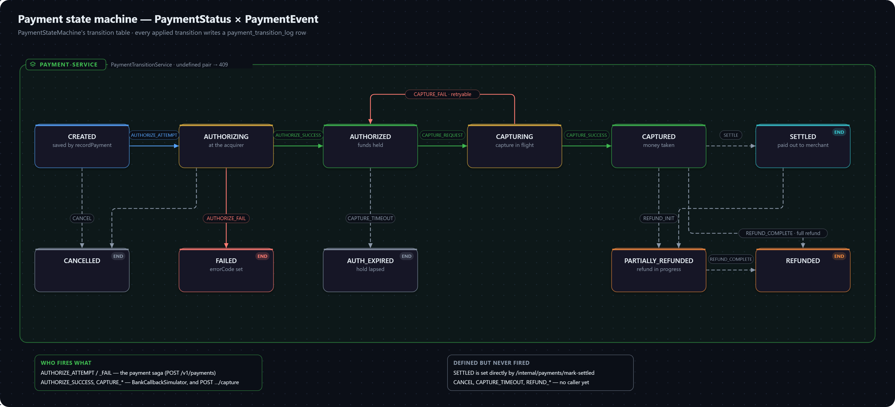
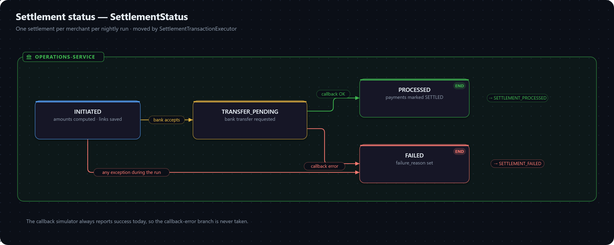
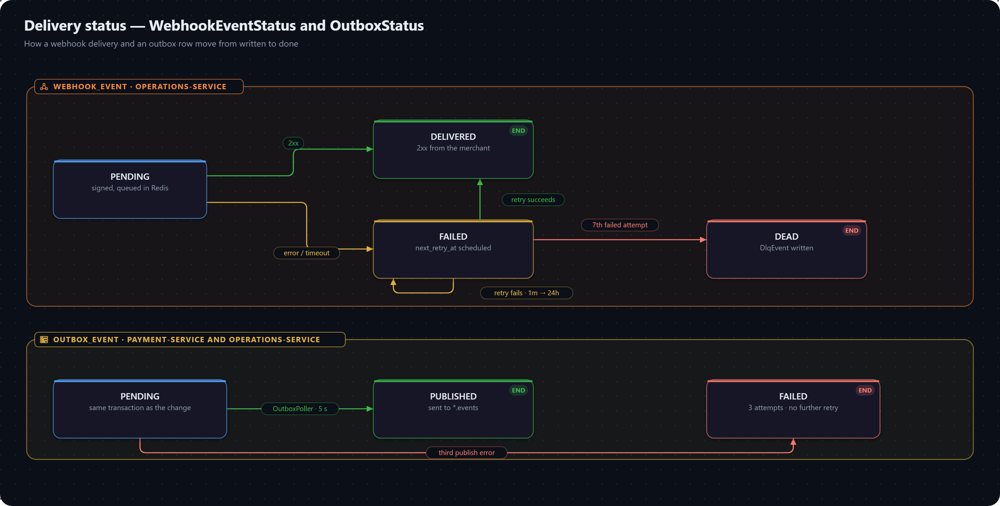

# Enums and State Machines

Every enum lives in `common-lib`'s `enums` package, so all services speak the same status strings, and is stored with `@Enumerated(EnumType.STRING)` and an explicit column length — never as an ordinal, so reordering an enum can't silently remap existing rows.

## merchant-service

| Enum | Values | Used by |
|---|---|---|
| `MerchantStatus` | `PENDING_KYC`, `ACTIVE`, `SUSPENDED` | `merchant.status` and `merchant.status_before_suspension` (`PENDING_KYC` on signup, `ACTIVE` after KYC, `SUSPENDED` by the operator) |
| `BusinessType` | `LLP`, `PROPRIETORSHIP`, `PARTNERSHIP`, `PRIVATE_LIMITED`, `PUBLIC_LIMITED`, `TRUST` | `merchant.business_type` |
| `UserRole` | `OWNER`, `ADMIN`, `TEAM` | `app_user.role` — carried in the JWT and enforced (see [roles](../architecture/security-model.md#roles-and-sessions)) |
| `AuditAction` | `SETTLEMENT_BANK_CHANGED`, `KYC_VERIFIED`, `PASSWORD_CHANGED`, `API_KEY_CREATED`, `API_KEY_REVOKED`, `API_KEY_ROTATED`, `WEBHOOK_CONFIG_CREATED`, `WEBHOOK_CONFIG_UPDATED`, `WEBHOOK_CONFIG_DELETED`, `WEBHOOK_SECRET_ROTATED`, `USER_ADDED`, `USER_ROLE_CHANGED`, `USER_REMOVED`, `MERCHANT_SUSPENDED`, `MERCHANT_REACTIVATED`, `SETTLEMENT_RUN_TRIGGERED` | `audit_log.action` — check constraint, widened in a migration |
| `AuditActorType` | `USER`, `API_KEY`, `PLATFORM_ADMIN`, `SYSTEM` | `audit_log.actor_type` — check constraint |
| `Environment` | `TEST`, `LIVE` | `api_key.environment`; forwarded by the gateway as `X-Environment` |

## payment-service

| Enum | Values | Used by |
|---|---|---|
| `OrderStatus` | `CREATED`, `ATTEMPTED`, `PAID`, `CANCELLED`, `EXPIRED` | `order_record.order_status` |
| `PaymentStatus` | `CREATED`, `AUTHORIZING`, `AUTHORIZED`, `CAPTURING`, `CAPTURED`, `FAILED`, `CANCELLED`, `REFUNDED`, `PARTIALLY_REFUNDED`, `SETTLED`, `AUTH_EXPIRED` | `payment.status`, `payment_transition_log.from_status` / `to_status` |
| `PaymentEvent` | `AUTHORIZE_ATTEMPT`, `AUTHORIZE_SUCCESS`, `AUTHORIZE_FAIL`, `CAPTURE_REQUEST`, `CAPTURE_SUCCESS`, `CAPTURE_FAIL`, `REFUND_INIT`, `REFUND_COMPLETE`, `SETTLE`, `CANCEL`, `CAPTURE_TIMEOUT`, `REFUND_FAIL` | `payment_transition_log.event` |
| `PaymentActor` | `CUSTOMER`, `MERCHANT`, `SYSTEM` | `payment_transition_log.actor` — `SYSTEM` for background jobs, `MERCHANT` for a dashboard user, `CUSTOMER` for an API-key call |
| `PaymentMethod` | `CARD`, `NETBANKING`, `UPI`, `WALLET` | `payment.method` — stored by ordinal, so never reorder it |
| `RefundStatus` | `PENDING`, `PROCESSING`, `PROCESSED`, `FAILED` | `refund.status` — `PROCESSING` is defined but never set: a refund goes from `PENDING` straight to its outcome |
| `ChaosMode` | `NORMAL`, `SLOW`, `FAILURE`, `SUCCESS`, `TIMEOUT` | `payment.simulator.chaos-mode` — see [mock acquirer](../api/mock-acquirer.md) |

## vault-service

| Enum | Values | Used by |
|---|---|---|
| `CardBrand` | `VISA`, `MASTERCARD`, `RUPAY`, `AMEX` | `vault_card.brand` |

## operations-service and the outboxes

| Enum | Values | Used by |
|---|---|---|
| `SettlementStatus` | `INITIATED`, `TRANSFER_PENDING`, `PROCESSED`, `FAILED` | `settlement.status` |
| `WebhookEventStatus` | `PENDING`, `DELIVERED`, `FAILED`, `DEAD` | `webhook_event.status` |
| `EventAggregateType` | `PAYMENT`, `ORDER`, `REFUND`, `SETTLEMENT` | `outbox_event.aggregate_type`; selects the Kafka topic |
| `OutboxStatus` | `PENDING`, `PUBLISHED`, `FAILED` | `outbox_event.status` |

## Payment state machine

`PaymentStatus` is the state and `PaymentEvent` the trigger. `PaymentStateMachine` holds the table of allowed pairs; `PaymentTransitionService.apply` validates a move against it — an undefined pair is `409 INVALID_STATE_TRANSITION` — sets the new status and writes a `payment_transition_log` row. See [decision 0007](../architecture/decisions/0007-validated-payment-state-machine.md).

| From | Event | To | Fired by |
|---|---|---|---|
| `CREATED` | `AUTHORIZE_ATTEMPT` | `AUTHORIZING` | the payment saga, before calling the acquirer |
| `AUTHORIZING` | `AUTHORIZE_SUCCESS` | `AUTHORIZED` | `BankCallbackSimulator` |
| `AUTHORIZING` | `AUTHORIZE_FAIL` | `FAILED` | the saga (acquirer failure or compensation), or the simulator |
| `AUTHORIZED` | `CAPTURE_REQUEST` | `CAPTURING` | the simulator's auto-capture, or `POST …/capture` |
| `CAPTURING` | `CAPTURE_SUCCESS` | `CAPTURED` | the same |
| `CAPTURING` | `CAPTURE_FAIL` | `AUTHORIZED` | the same — a failed capture is retryable, not terminal |
| `CAPTURED`, `PARTIALLY_REFUNDED` | `SETTLE` | `SETTLED` | `mark-settled`, after a payout is confirmed |
| `CAPTURED`, `PARTIALLY_REFUNDED`, `SETTLED` | `REFUND_INIT` | `PARTIALLY_REFUNDED` | `RefundService` — it refuses a `SETTLED` payment before getting here |
| `PARTIALLY_REFUNDED`, `CAPTURED` | `REFUND_COMPLETE` | `REFUNDED` | `RefundProcessingService`, once the processed refunds equal the payment |
| `PARTIALLY_REFUNDED` | `REFUND_FAIL` | `CAPTURED` | `RefundProcessingService`, when a refund fails and no other is pending or done |
| `CREATED`, `AUTHORIZING` | `CANCEL` | `CANCELLED` | nothing |
| `AUTHORIZED` | `CAPTURE_TIMEOUT` | `AUTH_EXPIRED` | `PaymentTimeoutSweeper` |

`AUTHORIZING` and `CAPTURING` are in-flight states: they record that a request has gone to the acquirer, which is what makes a crash mid-call recoverable instead of ambiguous. `AUTH_EXPIRED` would cover an authorization never captured in time — the hold lapses and no money is taken.

## Settlement status

| From | To | When |
|---|---|---|
| — | `INITIATED` | Amounts computed and payment links saved |
| `INITIATED` | `TRANSFER_PENDING` | The bank accepted the transfer and returned a reference |
| `INITIATED` | `FAILED` | Any exception during the run for that merchant |
| `TRANSFER_PENDING` | `PROCESSED` | The payout callback succeeded; payments marked `SETTLED`; `SETTLEMENT_PROCESSED` published |
| `TRANSFER_PENDING` | `FAILED` | The payout callback reported an error; `SETTLEMENT_FAILED` published. The payout simulator declines a share of transfers, and all of them in `FAILURE` mode |

## Delivery status

**`WebhookEventStatus`** — `PENDING` when created and queued; `DELIVERED` on a `2xx`; `FAILED` after a failed attempt with `next_retry_at` set (and back to `DELIVERED` if a retry succeeds); `DEAD` after the seventh failure, with a `dlq_event` written.

**`OutboxStatus`** — `PENDING` when written with the domain change; `PUBLISHED` once sent to Kafka; `FAILED` after the third failed publish, with no further retry.
