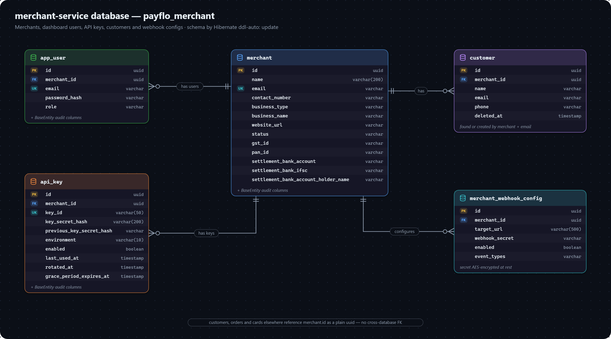

# merchant-service data model

Merchants, the people who log in for them, their API keys, their customers and their webhook endpoints. Database: `payflo_merchant`.

Every table here is merchant-scoped by a real foreign key to `merchant` — they all live in this one database.

## MERCHANT

A business onboarded onto the platform — the tenant everything else hangs off.

| Field | Meaning |
|---|---|
| `id` | Primary key. Every other service refers to a merchant by this id, as a plain UUID. |
| `name` | Display or trading name, up to 200 characters. |
| `email` | The merchant's contact email, unique — distinct from individual `app_user` login emails, though signup uses the same one for both. |
| `contact_number`, `website_url` | Contact details. |
| `business_type` | Legal structure — one of `BusinessType`. |
| `business_name` | Registered legal name, which can differ from the trading name. |
| `status` | `MerchantStatus` — `PENDING_KYC` on signup; nothing moves it on yet (there is no KYC flow). |
| `gst_id`, `pan_id` | Tax registration numbers for KYC. |
| `settlement_bank_account`, `settlement_bank_ifsc`, `settlement_bank_account_holder_name` | Where nightly payouts go — read by operations-service through `GET /internal/merchants/{id}/settlement-bank-details`. |

## APP_USER

A person with dashboard login access, belonging to one merchant.

| Field | Meaning |
|---|---|
| `merchant_id` | FK → `merchant`. |
| `email` | Login email, unique across all users. |
| `password_hash` | bcrypt hash; the password itself is never stored. |
| `role` | `UserRole` — `OWNER` for the user created at signup. Carried in the JWT, but nothing checks it yet. |

## API_KEY

Credentials for a merchant's own backend, rotatable without breaking an integration.

| Field | Meaning |
|---|---|
| `merchant_id` | FK → `merchant`. Indexed with `environment` and `enabled`. |
| `key_id` | The public half, unique — `fp_<environment>_<random>`, safe to display. |
| `key_secret_hash` | bcrypt hash of the secret, which is shown once at creation and never again. |
| `previous_key_secret_hash` | The prior hash after a rotation, accepted until `grace_period_expires_at`. |
| `environment` | `TEST` or `LIVE`. |
| `enabled` | `false` once revoked; the row is never deleted. |
| `last_used_at` | Meant to record the last successful authentication — never written yet. |
| `rotated_at`, `grace_period_expires_at` | When the key was last rotated, and when the previous secret stops working (24 hours later). |

## CUSTOMER

An end customer of one merchant — customers are never shared across merchants.

| Field | Meaning |
|---|---|
| `merchant_id` | FK → `merchant`. |
| `name`, `email`, `phone` | Contact details. `email` is indexed: `POST /internal/customers/find-or-create` looks a customer up by merchant and email, and creates one if there is none. |
| `deleted_at` | Soft-delete marker. |

## MERCHANT_WEBHOOK_CONFIG

One endpoint a merchant wants events delivered to.

| Field | Meaning |
|---|---|
| `merchant_id` | FK → `merchant`. Indexed with `enabled`. |
| `target_url` | The merchant's endpoint, `http(s)://…`, up to 500 characters. |
| `webhook_secret` | The signing secret, generated by the server, returned once on creation and stored **AES-encrypted** with `webhook.secret-encryption-key`. Decrypted only to hand to operations-service for signing. |
| `enabled` | `true` on creation; nothing sets it to `false` yet. |
| `event_types` | Comma-separated event names this endpoint wants (`PAYMENT_STATUS_CHANGED,ORDER_CREATED`); blank or `ALL` means every event. |
