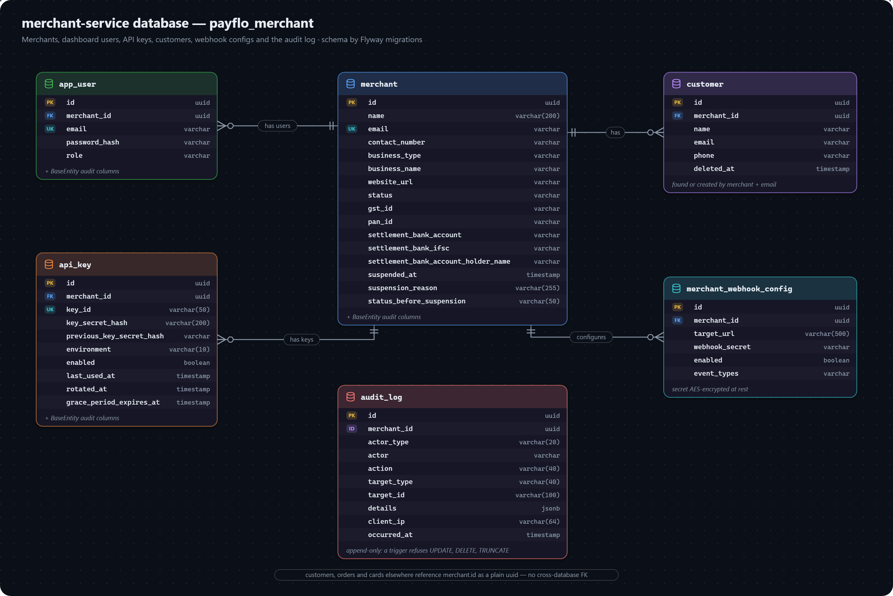

# merchant-service data model

Merchants, the people who log in for them, their API keys, their customers and their webhook endpoints. Database: `payflo_merchant`.

Every table here is merchant-scoped by a real foreign key to `merchant` — they all live in this one database.

## MERCHANT

A business onboarded onto the platform — the tenant everything else hangs off.

| Field | Meaning |
|---|---|
| `id` | Primary key. Every other service refers to a merchant by this id, as a plain UUID. |
| `name` | Display or trading name, up to 200 characters. |
| `email` | The merchant's contact email, unique — distinct from individual `app_user` login emails, though signup uses the same one for both. |
| `contact_number`, `website_url` | Contact details. |
| `business_type` | Legal structure — one of `BusinessType`. |
| `business_name` | Registered legal name, which can differ from the trading name. |
| `status` | `MerchantStatus` — `PENDING_KYC` on signup, `ACTIVE` once it passes the (simulated) [KYC](../api/merchant-account.md#kyc) step, `SUSPENDED` by the platform operator through the [admin API](../api/admin.md). Only `ACTIVE` merchants are settled; a `SUSPENDED` one is refused at the gateway and can't log in. |
| `suspended_at`, `suspension_reason`, `status_before_suspension` | Set when the operator suspends the merchant (V2), cleared when it is reactivated. `status_before_suspension` (`PENDING_KYC` or `ACTIVE`) is what reactivation puts back, so a merchant suspended before it passed KYC doesn't come back `ACTIVE`. |
| `gst_id`, `pan_id` | Tax registration numbers for KYC. |
| `settlement_bank_account`, `settlement_bank_ifsc`, `settlement_bank_account_holder_name` | Where nightly payouts go — read by operations-service through `GET /internal/merchants/{id}/settlement-bank-details`. The account number is stored AES-GCM-encrypted with an `enc1:` prefix (a value without it is read as plain text, for rows from before encryption); set through `PUT /v1/merchants/me/settlement-bank`. |

## APP_USER

A person with dashboard login access, belonging to one merchant.

| Field | Meaning |
|---|---|
| `merchant_id` | FK → `merchant`. |
| `email` | Login email, unique across all users. |
| `password_hash` | bcrypt hash; the password itself is never stored. |
| `role` | `UserRole` — `OWNER` for the user created at signup. Carried in the JWT and enforced: a `TEAM` login is read-only at the gateway, and merchant-service's `CallerPolicy` limits the dashboard-only actions by role (see [roles](../architecture/security-model.md#roles-and-sessions)). |

## API_KEY

Credentials for a merchant's own backend, rotatable without breaking an integration.

| Field | Meaning |
|---|---|
| `merchant_id` | FK → `merchant`. Indexed with `environment` and `enabled`. |
| `key_id` | The public half, unique — `pf_<environment>_<random>`, safe to display. |
| `key_secret_hash` | bcrypt hash of the secret, which is shown once at creation and never again. |
| `previous_key_secret_hash` | The prior hash after a rotation, accepted until `grace_period_expires_at`. |
| `environment` | `TEST` or `LIVE`. |
| `enabled` | `false` once revoked; the row is never deleted. |
| `last_used_at` | Never written: the gateway authenticates from a cache, so there is no write per request to hang it on. |
| `rotated_at`, `grace_period_expires_at` | When the key was last rotated, and when the previous secret stops working (24 hours later). |

## CUSTOMER

An end customer of one merchant — customers are never shared across merchants.

| Field | Meaning |
|---|---|
| `merchant_id` | FK → `merchant`. |
| `name`, `email`, `phone` | Contact details. `(merchant_id, email)` is unique: `POST /internal/customers/find-or-create` looks a customer up by merchant and email (case-insensitively, as it stores the lowercased email) and creates one if there is none, and two simultaneous requests for a new customer end with one row. |
| `deleted_at` | Soft-delete marker. |

## MERCHANT_WEBHOOK_CONFIG

One endpoint a merchant wants events delivered to.

| Field | Meaning |
|---|---|
| `merchant_id` | FK → `merchant`. Indexed with `enabled`. |
| `target_url` | The merchant's endpoint, `http(s)://…`, up to 500 characters. |
| `webhook_secret` | The signing secret, generated by the server, returned once on creation and stored **AES-encrypted** with `webhook.secret-encryption-key`. Decrypted only to hand to operations-service for signing. |
| `enabled` | `true` on creation; `PUT /v1/merchants/webhooks/{id}` with `enabled: false` pauses deliveries to this endpoint. |
| `event_types` | Comma-separated event names this endpoint wants (`PAYMENT_STATUS_CHANGED,ORDER_CREATED`); blank or `ALL` means every event. |

## AUDIT_LOG

Who did which sensitive thing to a merchant's account, and when — see [the audit log](../api/audit-log.md). Append-only: a database trigger (`audit_log_append_only`, V2) refuses `UPDATE`, `DELETE` and `TRUNCATE`, so there is no `updated_at`/`created_by`: this entity doesn't extend `BaseEntity`.

| Field | Meaning |
|---|---|
| `id` | Primary key (UUID, time-ordered). |
| `merchant_id` | The merchant acted on, a plain id with no foreign key (an entry outlives anything); null for an action on no one merchant. Indexed with `occurred_at` (`idx_audit_log_merchant_occurred`) for a merchant's own history. |
| `actor_type` | `AuditActorType` — `USER`, `API_KEY`, `PLATFORM_ADMIN` or `SYSTEM`. |
| `actor` | The user's email, the API key's public id, or `platform-admin`/`system`. Never a secret. |
| `action` | `AuditAction`, a name from the table in [the audit log](../api/audit-log.md#what-is-recorded). |
| `target_type`, `target_id` | What it was done to (`API_KEY`, `USER`, `WEBHOOK_CONFIG`, `MERCHANT`) and its id. |
| `details` | `jsonb`: the facts of the change (a role from→to, a masked account number, a host), with any secret-looking name redacted before it is stored. |
| `client_ip` | The caller's address as the gateway saw it. |
| `occurred_at` | When, set by the service in the same transaction as the change. Indexed (`idx_audit_log_occurred`) for the operator's platform-wide view. |

`action` and `actor_type` have check constraints naming every value: a new constant widens them in a migration (an integration test writes every `AuditAction` × `AuditActorType` to catch a forgotten one).
