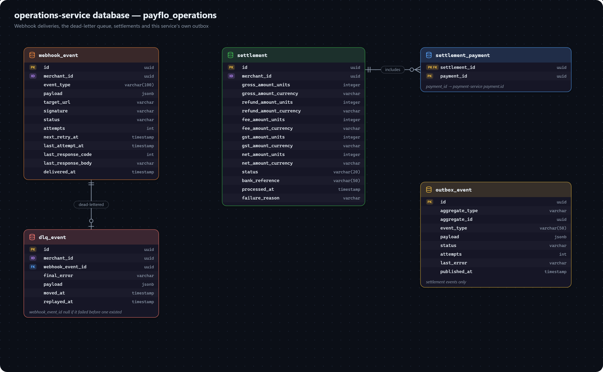

# operations-service data model

Webhook deliveries and their dead letters, settlements, and this service's own outbox. Database: `payflo_operations`.

## WEBHOOK_EVENT

One delivery of one domain event to one merchant endpoint, with its retry bookkeeping.

| Field | Meaning |
|---|---|
| `merchant_id` | Plain id → merchant-service. |
| `event_type` | The domain event, e.g. `PAYMENT_STATUS_CHANGED`. |
| `payload` | The body sent to the merchant, `jsonb`. |
| `target_url` | Copied from the webhook config when the event was created, so a later config change never rewrites history. At most 255 characters, which the config's URL is limited to. |
| `request_body` | The exact JSON string that is sent, and signed on every attempt (`text`). Null on rows from before it was stored. |
| `event_id` | The event's stable id, the same for every delivery and retry of it; sent as `X-PayFlo-Event-Id` and as `id` in the body. |
| `event_occurred_at` | When the change this event reports happened: the creation time of the outbox row, carried in the Kafka envelope as `occurredAt` (added by migration `V3`). The webhook delivery latency, and so the 30-second SLA, runs from here to the `2xx` answer. Null on rows from before `V3`. |
| `config_id` | The merchant's webhook config the event was created for (a plain id → merchant-service). A delivery asks merchant-service for that config's current secret and signs the body with it at send time, with a fresh timestamp; the secret is never stored here. Null on rows from before V2. |
| `signature` | Only on rows created before V2 (`config_id` is null on them): the HMAC-SHA256 computed when the event was created, sent as `X-PayFlo-Signature` without a timestamp. Null on newer rows, which are signed at send time. |
| `status` | `WebhookEventStatus` — see [delivery status](enums.md#delivery-status). |
| `attempts` | Delivery attempts so far; the seventh failure dead-letters it. |
| `next_retry_at` | When the next attempt is due — and, while an attempt is in flight, a two-minute lease that stops anything else delivering it. Mirrors the Redis retry queue, so a lost queue entry can be rebuilt. Indexed with `status` (`idx_webhook_event_status_next_retry`) for the reconciler. |
| `last_attempt_at`, `last_response_code`, `last_response_body` | The last attempt and what the merchant's endpoint answered — for debugging. |
| `delivered_at` | When a `2xx` came back. |

## DLQ_EVENT

A webhook that exhausted its retries, or a Kafka record that couldn't be turned into one.

| Field | Meaning |
|---|---|
| `merchant_id` | Plain id → merchant-service. |
| `webhook_event_id` | One-to-one FK → `webhook_event`; `null` when processing failed before a webhook event existed. |
| `final_error` | The last error recorded. |
| `payload` | The event data, preserved for a replay. |
| `moved_at` | When it was dead-lettered. |
| `replayed_at` | When it was replayed, through `POST /v1/webhook-deliveries/{id}/replay`. |

## SETTLEMENT

One merchant's payout from one nightly run.

| Field | Meaning |
|---|---|
| `merchant_id` | Plain id → merchant-service. |
| `gross_amount_*` | The sum of the settled payments. |
| `refund_amount_*` | Refunds to deduct — always zero until refunds exist. |
| `fee_amount_*` | The platform fee, 2% of gross. |
| `gst_amount_*` | GST, 18% of the fee. |
| `net_amount_*` | What is paid out: gross − fee − GST. |
| `status` | `SettlementStatus` — see [settlement status](enums.md#settlement-status). |
| `bank_reference` | The transfer reference returned by the (mock) bank. Null until the payout is registered (`TRANSFER_PENDING`). |
| `processed_at` | When the bank confirmed the payout. |
| `payments_settled_at` | When payment-service confirmed the covered payments are `SETTLED`. A `PROCESSED` settlement without it isn't finished: its payments are still held back from new payouts, and the recovery job completes it. |
| `failure_reason` | Why it failed, if it did: `TRANSFER_NOT_STARTED : <exception class>`, `SIM_PAYOUT_DECLINED : …` or `TRANSFER_TIMEOUT : …`. |

Each amount is its own `Money` pair (`*_units`, `*_currency`).

## SETTLEMENT_PAYMENT

Links a settlement to each payment it pays out — the audit trail from a payout back to the exact payments it covers.

| Field | Meaning |
|---|---|
| `settlement_id` | Part of the composite key (`SettlementPaymentId`); FK → `settlement`. |
| `payment_id` | Part of the composite key; plain id → payment-service `payment`. |

## OUTBOX_EVENT

Same shape as [payment-service's](payment-service.md#outbox_event), for `SETTLEMENT` events — `SETTLEMENT_PROCESSED` and `SETTLEMENT_FAILED`, published to `settlements.events`.
