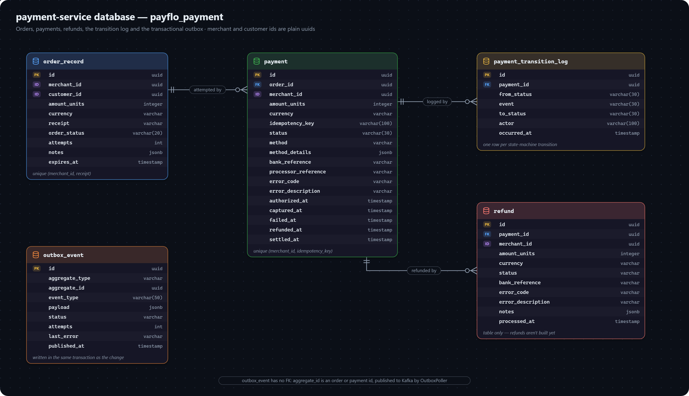

# payment-service data model

Orders, payments and their history, refunds, and the outbox. Database: `payflo_payment`.

`merchant_id` and `customer_id` here are plain UUIDs — merchants and customers live in merchant-service's database, so a foreign key was never possible.

## ORDER_RECORD

What is being paid for. A payment is always attempted against an order. (Named `order_record` because `order` is an SQL keyword.)

| Field | Meaning |
|---|---|
| `merchant_id` | Plain id → merchant-service. Indexed. |
| `customer_id` | Plain id → merchant-service `customer`, when the order carried a `customer` block. |
| `amount_units`, `currency` | The order amount (`Money`). |
| `receipt` | The merchant's own reference, up to 100 characters. Unique per merchant (`(merchant_id, receipt)` index). |
| `order_status` | `OrderStatus` — `CREATED`, then `ATTEMPTED` on the first payment attempt, then `PAID` on capture. |
| `attempts` | How many payment attempts have been made against it. |
| `notes` | Free-form merchant metadata, `jsonb`. |
| `expires_at` | 30 minutes after creation unless the request sets it. Nothing expires orders yet. |

## PAYMENT

One attempt to pay an order by one method.

| Field | Meaning |
|---|---|
| `order_id` | FK → `order_record`. Indexed. |
| `merchant_id` | Plain id → merchant-service. Indexed. |
| `amount_units`, `currency` | Copied from the order. |
| `idempotency_key` | The caller's `X-Idempotency-Key`, or a random value. Unique per merchant (`(merchant_id, idempotency_key)`), which is what makes a retried payment return the original. |
| `status` | `PaymentStatus`, moved only by the [state machine](enums.md#payment-state-machine). |
| `method` | `CARD`, `UPI` or `NETBANKING` (`WALLET` exists in the enum but has no adapter). |
| `method_details` | Method-specific input, `jsonb` — a card `token`, a UPI `vpa`, a net-banking `bank`. |
| `processor_reference` | The mock acquirer's reference for a `Pending` answer. |
| `bank_reference` | The bank's reference, once one is returned. |
| `error_code`, `error_description` | Set when the payment fails. |
| `authorized_at`, `captured_at`, `failed_at`, `refunded_at`, `settled_at` | When each milestone happened. |

## PAYMENT_TRANSITION_LOG

The history of every status change, since `payment.status` is overwritten in place.

| Field | Meaning |
|---|---|
| `payment_id` | FK → `payment`. Indexed. |
| `from_status`, `to_status` | The change, as `PaymentStatus` values. |
| `event` | The `PaymentEvent` that caused it. |
| `actor` | `PaymentActor` — always `SYSTEM` today. |
| `occurred_at` | When it happened. |

## REFUND

A refund against a payment. **The table exists but refunds aren't built** — nothing reads or writes it.

| Field | Meaning |
|---|---|
| `payment_id` | FK → `payment`. |
| `merchant_id` | Plain id → merchant-service. |
| `amount_units`, `currency` | The refund amount, possibly less than the payment. |
| `status` | `RefundStatus`, default `PENDING`. |
| `bank_reference`, `error_code`, `error_description`, `notes`, `processed_at` | The outcome, when there is one. |

## OUTBOX_EVENT

An event waiting to be published — see [decision 0005](../architecture/decisions/0005-transactional-outbox-for-events.md).

| Field | Meaning |
|---|---|
| `aggregate_type` | `EventAggregateType` — `ORDER` or `PAYMENT` here; picks the topic (`orders.events`, `payments.events`). |
| `aggregate_id` | The order or payment id. No foreign key: it can name either table. |
| `event_type` | `ORDER_CREATED`, `PAYMENT_CREATED`, `PAYMENT_STATUS_CHANGED`, `PAYMENT_AUTHORIZATION_COMPENSATED`. |
| `payload` | The event body, `jsonb`, published inside an envelope. |
| `status` | `OutboxStatus` — `PENDING` → `PUBLISHED`, or `FAILED` after 3 attempts. |
| `attempts`, `last_error`, `published_at` | Publishing bookkeeping. |
