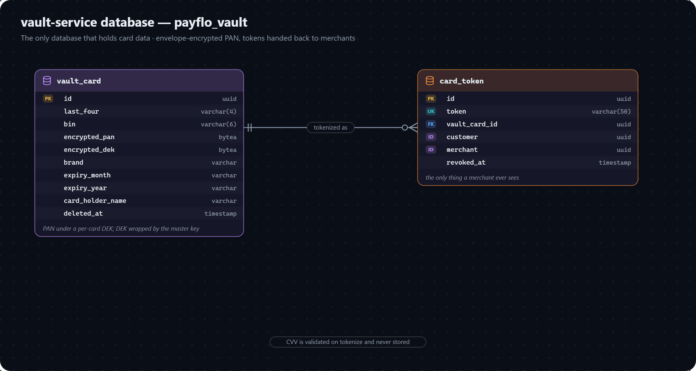

# vault-service data model

The only database that holds card data. Database: `payflo_vault`.

## VAULT_CARD

A card, encrypted at rest. Never exposed directly — always reached through a `card_token`.

| Field | Meaning |
|---|---|
| `last_four` | The last four digits, safe to display. |
| `bin` | The first six digits (bank identification number), identifying the issuer. |
| `encrypted_pan` | The full card number, encrypted with AES-256-GCM under this card's own data key. |
| `encrypted_dek` | That data key, itself encrypted with the master key (`vault.master-key`). Envelope encryption: a database dump alone decrypts nothing. |
| `brand` | `CardBrand`, detected from the number's leading digits. |
| `expiry_month`, `expiry_year` | Card expiry, stored as strings. |
| `card_holder_name` | Name on the card. |
| `deleted_at` | Soft-delete marker. |

The CVV is validated on tokenization and never stored anywhere.

## CARD_TOKEN

The opaque stand-in for a vaulted card — the only thing a merchant ever holds.

| Field | Meaning |
|---|---|
| `token` | The token value, unique. What a merchant sends as `methodDetails.token` in a card payment. |
| `vault_card_id` | FK → `vault_card`. |
| `customer` | Plain id → merchant-service `customer`, if the merchant supplied one. |
| `merchant` | Plain id → merchant-service `merchant`. |
| `revoked_at` | When the token was revoked; nothing revokes tokens yet. |
